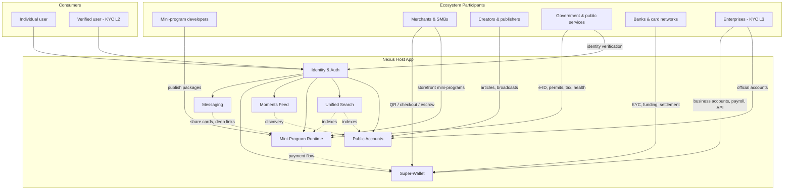
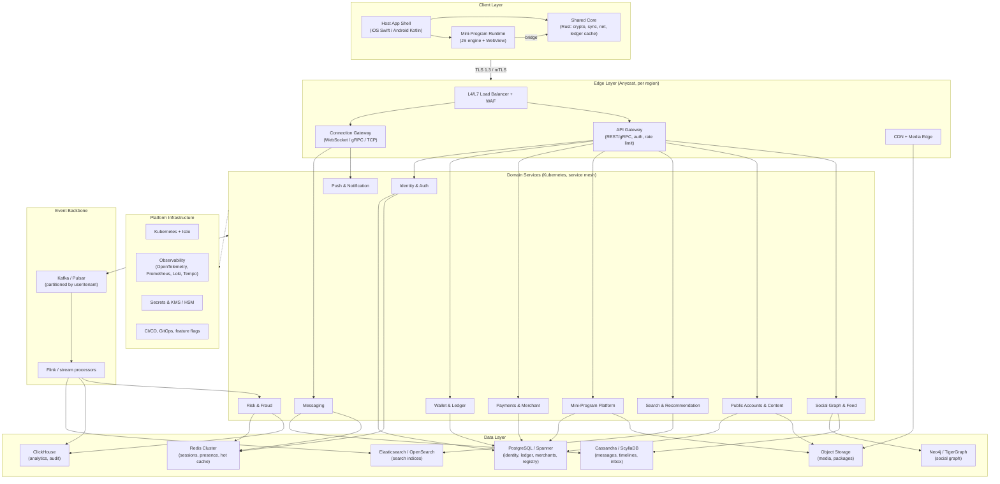
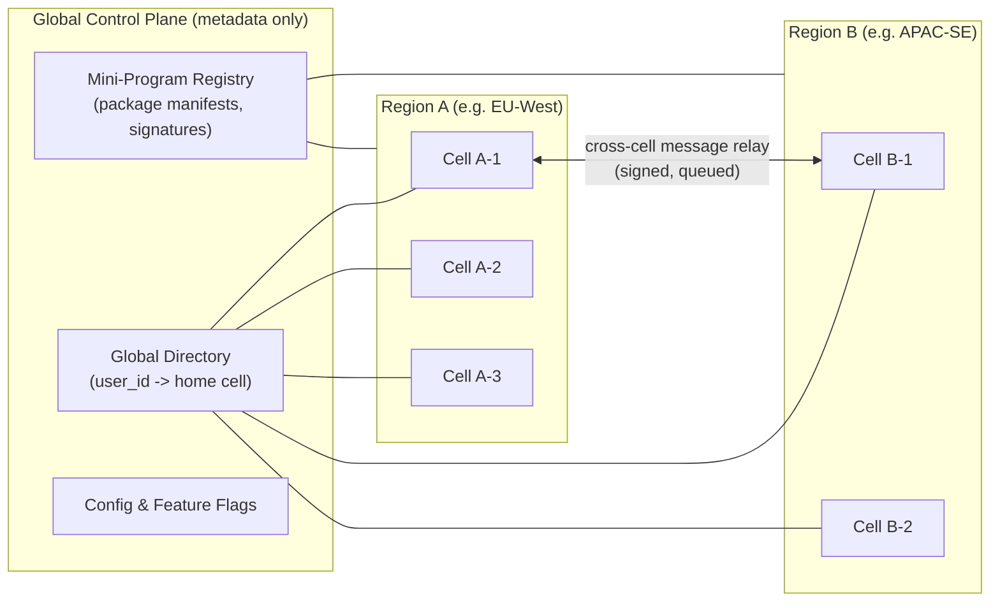
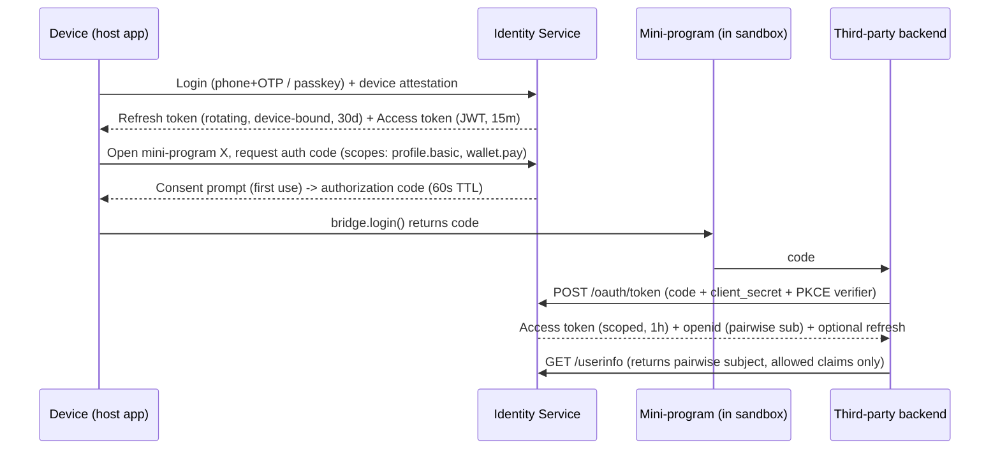
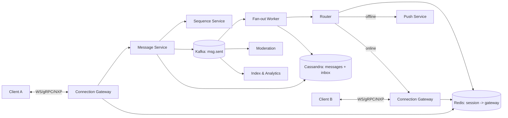
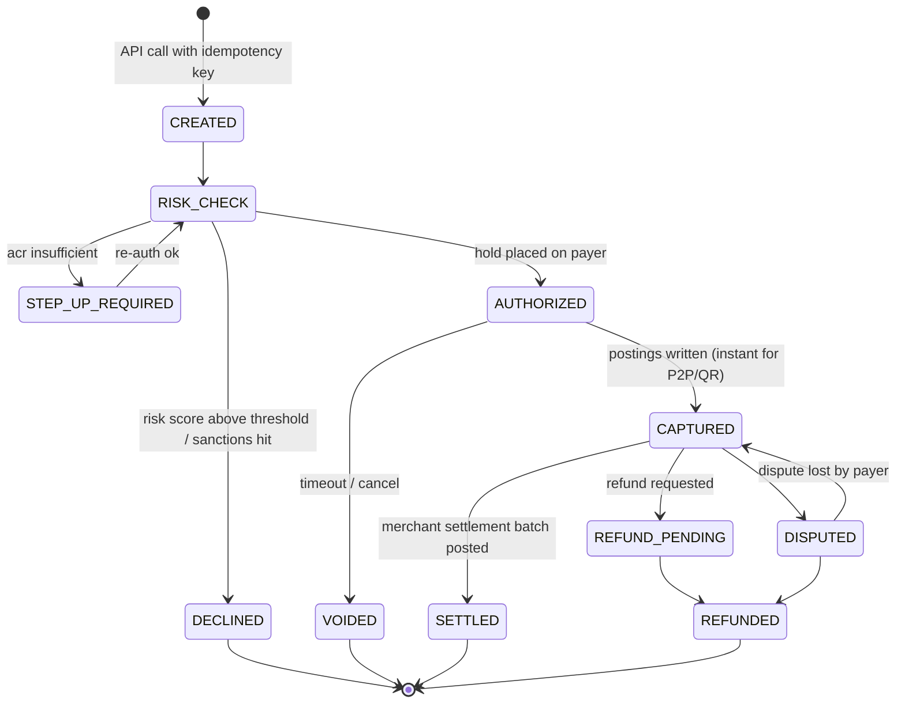
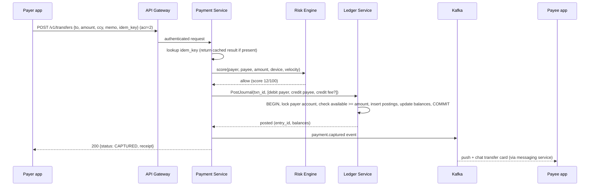
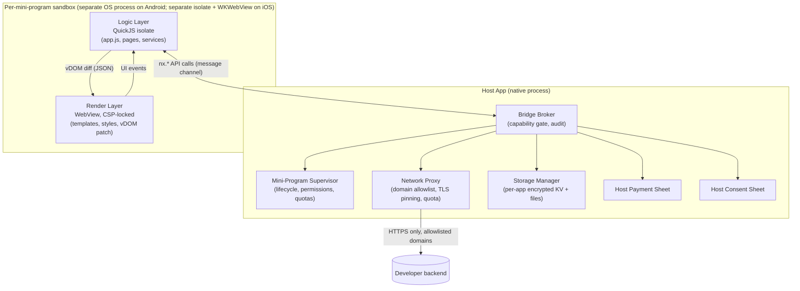
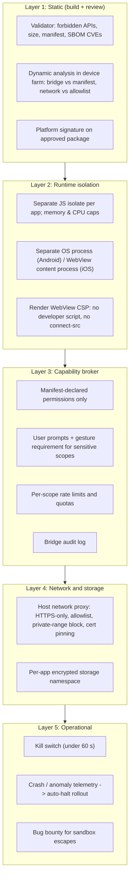
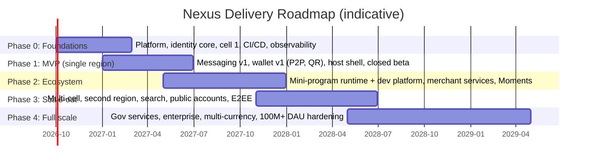

# Super-App Platform: Product Requirements Document & Technical Design Specification

| Field | Value |
|---|---|
| Document status | Draft v1.0 for architecture review |
| Owner | Product & Platform Architecture |
| Last updated | 2026-09-06 |
| Audience | Engineering leads, product, security, compliance, finance operations |
| Codename | **Nexus** (working name for the host app and platform) |

---

## Table of Contents

1. [Executive Summary & Ecosystem Mapping](#1-executive-summary--ecosystem-mapping)
2. [System Architecture Diagram & Technology Stack](#2-system-architecture-diagram--technology-stack)
3. [Core Module Detailed Specifications](#3-core-module-detailed-specifications)
   - 3.1 Unified Identity & Security Layer
   - 3.2 Real-Time Messaging & Social Graph
   - 3.3 Super-Wallet: Financial & Payment Infrastructure
   - 3.4 Mini-Program Ecosystem (Sandboxed Runtime)
   - 3.5 Social Feed (Moments)
   - 3.6 Search, Discovery & Public Accounts
4. [Data Models & Database Schema Framework](#4-data-models--database-schema-framework)
5. [Security, Privacy & Sandbox Architecture](#5-security-privacy--sandbox-architecture)
6. [Implementation Roadmap (MVP to Full Scale)](#6-implementation-roadmap-mvp-to-full-scale)
7. [Appendices](#7-appendices)

---

## 1. Executive Summary & Ecosystem Mapping

### 1.1 Vision

Nexus is a single mobile application that acts as the operating layer for a person's daily digital life: talking to people, paying for things, using third-party services, discovering content, and interacting with government and public services. The product thesis is that **identity, messaging, and money form a gravity well**: once a user's contacts, wallet, and verified identity live in one place, every additional service (a ride, a utility bill, a clinic appointment, a store) is one tap away with zero re-registration and zero re-entry of payment details.

The platform is deliberately split into two products:

1. **The host app** (consumer-facing): a thin, fast shell that owns identity, chat, wallet, feed, search, and the mini-program runtime.
2. **The developer and merchant platform** (B2B-facing): the tooling, APIs, review pipeline, and settlement rails that let third parties ship services inside the host app without shipping a native app.

### 1.2 Product Principles

| Principle | What it means in practice |
|---|---|
| **Identity once, everywhere** | One immutable user ID; every service (first- or third-party) consumes scoped tokens derived from it. Users never create a second account inside the app. |
| **The shell stays light** | Host app cold start under 1.5 s on a mid-range Android device; installed binary under 120 MB. Everything non-core is a dynamically loaded mini-program. |
| **Money is boring on purpose** | The ledger is double-entry, strongly consistent, idempotent, and auditable. No eventual consistency anywhere a balance is read for authorization. |
| **Works on bad networks** | Messaging and payments degrade gracefully on 2G/3G, lossy Wi-Fi, and captive portals. Weak-network behavior is a first-class test target. |
| **Third parties are untrusted by default** | Mini-programs execute in a sandbox with capability-based permissions, no direct network access to host data, and no shared storage with the host or other mini-programs. |
| **Regional by design** | Data residency, regulatory scope, and payment rails are per-region deployment cells, not global afterthoughts. |

### 1.3 Ecosystem Map



### 1.4 Value Flows

| Flow | Direction | Monetization / value |
|---|---|---|
| Consumer to merchant payment | Wallet, QR, in-mini-program checkout | Merchant discount rate (MDR) 0.1 to 0.6 % by category; interchange share with card networks |
| Consumer P2P transfer | Wallet balance to wallet balance | Free within balance; fee on card-funded or cash-out flows |
| Mini-program distribution | Developer to consumer via search, chat share, QR, feed | Platform fee on in-app purchases; paid placement in discovery; API tier pricing |
| Public account content | Creator to follower | Ad revenue share, tipping, paid subscriptions |
| Government services | Agency to citizen | Per-transaction service fee paid by agency; e-ID verification fee |
| Enterprise APIs | B2B | Usage-based pricing on messaging, payments, and verification APIs |

### 1.5 Target Scale and Non-Functional Envelope

| Metric | MVP (Phase 1) | Scale target (Phase 4) |
|---|---|---|
| Daily active users (DAU) | 1 M | 300 M+ |
| Peak concurrent WebSocket connections | 500 K | 100 M+ |
| Messages per day | 50 M | 50 B+ |
| Message delivery p99 latency (both parties online, same region) | < 500 ms | < 200 ms |
| Payments per second (peak, regional) | 500 TPS | 100 K+ TPS |
| Payment authorization p99 | < 800 ms | < 300 ms |
| Mini-program cold launch p90 (cached package) | < 1.5 s | < 800 ms |
| Host app cold start p90 (mid-range Android) | < 2 s | < 1.2 s |
| Availability (messaging, identity) | 99.9 % | 99.99 % |
| Availability (wallet authorization path) | 99.95 % | 99.995 % |
| Recovery point objective (ledger) | 0 (synchronous replication) | 0 |
| Recovery time objective (regional failover) | 30 min | < 5 min |

### 1.6 Personas

| Persona | Primary jobs to be done | Key constraints |
|---|---|---|
| Everyday consumer (urban, mid-range Android) | Chat with family, pay at shops, order food, split bills | Intermittent connectivity, limited storage, price sensitivity on data |
| Small merchant (street vendor to chain store) | Accept payments without hardware, see daily settlement, run promotions | Needs static QR that works offline for payer; same-day or T+1 settlement |
| Mini-program developer | Ship a service in days, reach users through chat share, get paid | Needs stable APIs, fast review, local testing, analytics |
| Creator / publisher | Publish content, grow followers, monetize | Needs rich editor, scheduling, analytics, anti-plagiarism |
| Government agency | Deliver services digitally with verified identity | Needs assurance-level identity, audit trail, data residency, accessibility |
| Enterprise | Internal communication, payroll, customer service, B2B payments | Needs SSO, admin controls, compliance exports, SLAs |

### 1.7 Scope

**In scope for this document:** host app shell, identity, messaging, social feed, wallet and payment rails, mini-program runtime and developer platform, search and discovery, public accounts, platform infrastructure, security, compliance, and a phased roadmap.

**Out of scope (separate documents):** ad-serving platform, gaming center, video streaming service, hardware wallet integration, detailed UX specifications and design system, per-country regulatory filings.

---

## 2. System Architecture Diagram & Technology Stack

### 2.1 Architectural Overview

The system is organized as **six layers** with strict downward dependencies. Every layer above the data layer is stateless and horizontally scalable. Regional deployment **cells** are independent failure domains that share only global identity directory metadata and the mini-program package registry.



### 2.2 Layer Responsibilities

| Layer | Responsibility | Scaling unit | Statefulness |
|---|---|---|---|
| Client | UI rendering, local cache, offline queue, crypto, mini-program execution | Per device | Local SQLite + encrypted key store |
| Edge | TLS termination, DDoS/WAF, connection affinity, auth pre-check, rate limiting, protocol translation | Per region, anycast | Connection-affine but reconstructible |
| Domain services | Business logic per bounded context | Per service, per cell | Stateless |
| Event backbone | Durable async fan-out, CDC, stream processing, replay | Per topic partition | Durable log |
| Data | System of record per domain | Per shard / keyspace | Stateful, replicated |
| Platform | Orchestration, mesh, observability, secrets, delivery | Global control plane, regional data plane | Control-plane state only |

### 2.3 Regional Cell Architecture

Each **cell** is a complete, self-sufficient deployment serving a user population (e.g., 20 to 50 M users). Cells are the unit of blast-radius containment and data residency.



Rules:

- A user has exactly one **home cell**. All writes for that user land there. The global directory maps `user_id -> cell_id` and is cached at the edge with a 5-minute TTL plus invalidation.
- Cross-cell interactions (a message from a user in cell A-1 to a user in cell B-2) are relayed through a signed, idempotent inter-cell queue. The payload is stored in both users' home cells, so each user's data stays in their residency region.
- Cross-region payments settle through a **correspondent ledger**: each region has a nostro/vostro-style clearing account pair; the user-facing transaction completes in the payer's cell, and the inter-region netting is a separate, batched, auditable process.
- Cells are sized so that losing one cell affects at most ~5 % of a region's users, and a cell can be re-homed (user migration) with a documented procedure.

### 2.4 Technology Stack

| Concern | Primary choice | Alternative / rationale |
|---|---|---|
| iOS client | Swift, SwiftUI + UIKit, Swift Concurrency | Native for performance and OS integration (biometrics, Secure Enclave, Wallet passes) |
| Android client | Kotlin, Jetpack Compose, Coroutines | Native; Android is the majority of target devices |
| Shared client core | Rust compiled to a static lib (via UniFFI) | One implementation of crypto, sync engine, message store, and network stack across platforms |
| Client local DB | SQLite with SQLCipher | Encrypted at rest; FTS5 for local chat search |
| Mini-program logic engine | QuickJS (Android, iOS) with an optional V8 / JavaScriptCore backend | Small footprint, deterministic, embeddable; per-mini-program isolate |
| Mini-program render layer | System WebView (WKWebView / Android WebView) with a virtual-DOM bridge | Uses OS-maintained rendering engine; no custom browser to patch |
| Edge gateway | Envoy (L7), Cloudflare/Akamai or self-run anycast (L3/L4) | Battle-tested, gRPC-native, WASM filters for custom auth |
| Service framework | Go (messaging, gateway, wallet, payments), Java/Kotlin (Spring Boot for merchant and back-office), Python (risk models, ML, data pipelines, developer tooling) | Go for high-concurrency I/O paths; Python for ML and analyst-facing tooling |
| Inter-service RPC | gRPC with Protobuf; Istio service mesh with mTLS | Strong contracts, streaming, mesh-enforced identity |
| Event backbone | Apache Kafka (or Pulsar for geo-replication needs) | Durable, partitioned, replayable; Pulsar's tiered storage and geo-replication are attractive for multi-region |
| Stream processing | Apache Flink | Exactly-once semantics for feed fan-out, counters, fraud features |
| Relational / transactional | PostgreSQL 16 (Citus for sharding) or Google Spanner / CockroachDB where globally consistent multi-region ACID is required | Ledger requires serializable isolation; Spanner/Cockroach for the cross-cell clearing ledger |
| Wide-column | Cassandra 5 or ScyllaDB | Message storage, inbox timelines, feed timelines; linear write scaling |
| Graph | Neo4j (Fabric) or TigerGraph | Friend-of-friend queries, mutual friends, group membership, privacy visibility calculation |
| Cache / presence | Redis Cluster (with Redis Enterprise or Dragonfly for scale) | Presence, session tokens, rate limiters, hot profile cache, idempotency keys |
| Search | OpenSearch / Elasticsearch | Unified search across contacts, chats (server-side only for cloud-backup opt-in), accounts, mini-programs, products |
| Object storage | S3-compatible (AWS S3, GCS, MinIO on-prem in sovereign regions) | Media, mini-program packages, exports |
| Analytics / audit | ClickHouse | High-volume immutable logs, audit trails, metrics rollups |
| Media processing | FFmpeg workers, image pipeline (libvips), transcoding via GPU nodes | Adaptive bitrate for video in feed and channels |
| Push | APNs, FCM, plus in-house persistent socket for China-style OEM push fragmentation | Fallback path for devices without Google services |
| Orchestration | Kubernetes, Argo CD (GitOps), Argo Rollouts (canary) | Standard cloud-native delivery |
| Observability | OpenTelemetry SDKs, Prometheus + Thanos, Grafana, Loki, Tempo | Vendor-neutral; traces span client to database |
| Secrets & keys | HashiCorp Vault, cloud KMS, FIPS 140-2 Level 3 HSM for payment and signing keys | PCI-DSS key management requirements |
| CI/CD | GitHub Actions or GitLab CI, Bazel for monorepo builds, Fastlane for mobile | Reproducible builds; SBOM generation |
| Feature flags & config | OpenFeature-compatible service (Flagsmith / Unleash) | Kill switches for every mini-program API and payment rail |

### 2.5 Cross-Cutting Concerns

**Service mesh and identity.** Every pod has a SPIFFE identity; mTLS is mandatory. Authorization between services is expressed as mesh policy (`payments-svc` may call `ledger-svc.Post` but never `ledger-svc.AdminAdjust`).

**Idempotency.** All mutating APIs accept an `Idempotency-Key` header (client-generated UUIDv7). Keys are stored in Redis with a 24-hour TTL and in PostgreSQL for financial operations (permanent).

**Observability.** A single `trace_id` propagates from the client SDK through the gateway, services, Kafka headers, and into database query comments. Every payment has a `payment_id` that is also a trace attribute.

**Backpressure.** Gateways enforce per-user and per-device token buckets; Kafka consumers use lag-based autoscaling; the wallet has an explicit admission controller that sheds non-critical reads before it sheds authorizations.

**Multi-tenancy.** Merchants, developers, and enterprise customers are tenants. Every row in a tenant-owned table carries `tenant_id`; row-level security (RLS) is enabled in PostgreSQL for back-office access.

---

## 3. Core Module Detailed Specifications

### 3.1 Unified Identity & Security Layer

#### 3.1.1 Requirements

| ID | Requirement | Priority |
|---|---|---|
| ID-01 | Every user has a globally unique, immutable `user_id` (128-bit, UUIDv7 for time ordering) assigned at first registration and never reused. | P0 |
| ID-02 | Login identifiers (phone, email, username, hardware key, passkey) are attached to and detached from the `user_id` without changing it. | P0 |
| ID-03 | Support phone + OTP, email + password, passkeys (WebAuthn / FIDO2), platform biometrics as a local unlock factor, and hardware security keys. | P0 |
| ID-04 | Device binding: each device receives a device certificate; sensitive operations require a bound device or step-up. | P0 |
| ID-05 | Tiered KYC: L0 anonymous (browse only), L1 Basic (phone verified), L2 Verified (government ID + liveness), L3 Enterprise (business registration + beneficial owner verification). | P0 |
| ID-06 | Act as an OAuth 2.1 / OpenID Connect provider for mini-programs and external partners, issuing short-lived scoped tokens. | P0 |
| ID-07 | RBAC for staff and merchant/enterprise sub-accounts with fine-grained permissions and mandatory audit logging. | P1 |
| ID-08 | Account recovery with risk-scored flows; no single factor can recover a wallet-enabled account. | P0 |
| ID-09 | Session management UI: list of devices, remote sign-out, login alerts. | P1 |

#### 3.1.2 Token Architecture



Key design decisions:

- **Pairwise pseudonymous subjects.** A mini-program never sees the global `user_id`. It receives an `open_id` that is unique per (user, mini-program) and a `union_id` per (user, developer organization) so a developer can link their own multiple mini-programs. This prevents cross-app tracking between unrelated developers.
- **Access tokens are JWTs signed with ES256**, key ID rotated every 24 hours, published at a JWKS endpoint. Tokens carry `sub`, `cell`, `kyc_level`, `scopes`, `device_id_hash`, `amr` (authentication methods), and `acr` (assurance level).
- **Refresh tokens are opaque, rotating, and device-bound.** Reuse of a rotated refresh token revokes the whole token family.
- **Step-up authentication** is expressed via `acr`. A payment over a threshold requires `acr >= 2` (biometric or PIN within the last 5 minutes); the wallet service rejects otherwise with `step_up_required`, and the client re-authenticates in place.

#### 3.1.3 KYC Tiers and Entitlements

| Tier | Verification | Wallet limits (illustrative, per region config) | Entitlements |
|---|---|---|---|
| L0 Anonymous | None | No wallet | Browse public content, read-only mini-programs |
| L1 Basic | Phone number (SMS OTP) + device attestation | Receive up to 500 units/month, no send | Chat, feed, most mini-programs |
| L2 Verified | Government ID OCR + NFC chip read where available + liveness + national ID database match + sanctions/PEP screening | Send/receive up to regional limits; card and bank linking | Full wallet, government services, merchant QR payments |
| L3 Enterprise | Business registration lookup, director/UBO verification, bank account micro-deposit, contract | Business limits; settlement accounts | Merchant services, public accounts with verified badge, enterprise APIs |

Verification is run by a **KYC orchestration service** that abstracts regional providers (national ID APIs, bank partner verification, third-party IDV vendors) behind a single interface: `verify(user_id, tier, evidence[]) -> decision{approved, rejected, manual_review}` with full evidence retention rules per jurisdiction.

#### 3.1.4 RBAC Model

- **Principals:** users, service accounts, staff, merchant staff, enterprise admins.
- **Roles** are scoped to a resource tree: `platform / region / tenant / mini-program`. Example: `merchant:cashier` on `tenant:12345` may create dynamic QR codes but not view settlement reports.
- **Policy engine:** Open Policy Agent (OPA) evaluated at the gateway and in services for defense in depth. Policies are versioned in git and deployed via GitOps.
- **Break-glass** access for operations is time-boxed, requires two approvers, and writes to an immutable audit stream.

---

### 3.2 Real-Time Messaging & Social Graph

#### 3.2.1 Requirements

| ID | Requirement | Priority |
|---|---|---|
| MSG-01 | 1-on-1 and group chats (groups up to 500 members at MVP, 2,000 for verified communities, 100,000-subscriber broadcast channels). | P0 |
| MSG-02 | Message types: text, image, video, voice note, file, location (static and live), contact card, sticker, mini-program card, payment/transfer card, poll, reply/quote, forward, reactions. | P0 |
| MSG-03 | Delivery semantics: at-least-once delivery with client-side de-duplication; per-conversation total ordering; delivery and read receipts. | P0 |
| MSG-04 | Offline sync: a device that has been offline for 30 days resumes with a bounded number of round trips (pull by sequence, not by scanning). | P0 |
| MSG-05 | Multi-device: up to 5 concurrent devices per user with consistent state; per-device read cursors. | P1 |
| MSG-06 | Transport encryption (TLS 1.3 + certificate pinning) for all chats; optional end-to-end encryption (E2EE) for 1-on-1 and small groups with a documented trade-off on server-side search and multi-device. | P0 (transport), P1 (E2EE) |
| MSG-07 | Weak network tolerance: message send succeeds over a lossy 2G link with a 40 % packet loss within 10 s p95, and never duplicates. | P0 |
| MSG-08 | Message recall within 2 minutes; edit within 15 minutes (with edit history visible to recipients). | P1 |
| MSG-09 | Live location sharing: 15-minute, 1-hour, 8-hour windows; updates every 3 to 10 s adaptive; battery budget under 3 %/hour. | P1 |
| MSG-10 | Content moderation hooks: hash matching for known illegal media, user reporting, group admin tools. | P0 |

#### 3.2.2 Protocol Design

The client-to-gateway protocol is a **length-prefixed binary framing over three interchangeable transports**:

1. **WebSocket over TLS 1.3** (default; passes most middleboxes, HTTP/2 or HTTP/3 where available).
2. **gRPC bidirectional streaming** (used when the network path supports HTTP/2 cleanly and for high-throughput enterprise clients).
3. **Custom TCP fallback ("NXP", Nexus Protocol)** on port 443 with a TLS-lookalike handshake for networks that throttle or break WebSockets. NXP is a minimal framed protocol with explicit per-frame acknowledgements, session resumption, and a tunable retransmission timer designed for high-latency, high-loss links.

All three transports carry the same **Protobuf-encoded frame**:

```protobuf
message Frame {
  uint32 version = 1;
  FrameType type = 2;          // AUTH, PING, PONG, SEND, ACK, PUSH, SYNC, RESUME, ERROR
  uint64 client_seq = 3;       // monotonically increasing per session; enables resumption
  bytes  payload = 4;          // type-specific message
  uint32 crc32c = 5;           // integrity over lossy links
}
```

Weak-network behaviors:

- **Session resumption:** on reconnect the client sends `RESUME(session_id, last_server_seq_received)`. The gateway replays frames from an in-memory ring buffer (60 s) or instructs a full `SYNC` from the inbox store.
- **Adaptive keepalive:** ping interval is negotiated from 30 s down to 10 s based on observed NAT timeouts and radio state; the client uses OS push as an out-of-band wake-up when the socket is dead.
- **Small-frame priority lanes:** text messages and ACKs go in a high-priority lane; media chunks in a low-priority lane with 64 KB chunks and resumable uploads (tus-style) via the media edge, not through the messaging socket.
- **Message-level idempotency:** every outbound message has a client-generated `client_msg_id` (UUIDv7). The server stores `(conversation_id, client_msg_id)` for 7 days to de-duplicate retries.

#### 3.2.3 Service Topology



**Connection Gateway.** Stateless except for in-memory connection tables. Each gateway node holds ~1 M connections (Go, epoll, ~10 KB per connection). On accept, it validates the access token, registers `user_id/device_id -> gateway_id` in Redis with a 90 s TTL refreshed by heartbeats.

**Sequence Service.** Assigns a strictly increasing `seq` per conversation and a per-user `inbox_seq`. Implemented as sharded Redis with Lua scripts, backed by a persisted high-water mark (allocated in blocks of 1,000 to survive failover without regressions).

**Message Service.** Validates, persists to the conversation timeline (write-once), publishes to Kafka, and returns the server ACK with `(seq, server_ts)` to the sender. The sender's client marks the message as sent only after this ACK.

**Fan-out strategy.**

| Conversation type | Strategy | Rationale |
|---|---|---|
| 1-on-1 and groups up to 500 | **Write fan-out**: one inbox row per recipient | Cheap reads on the hot path; a 500-member group is at most 500 writes |
| Communities 500 to 2,000 | **Hybrid**: inbox row for active members (opened conversation in the last 7 days), pull for the rest | Bounded write amplification |
| Broadcast channels (100 K+) | **Read fan-out**: single timeline, subscribers pull by `seq` | Avoids a 100 K-row write per post |

**Router.** Looks up the recipient's gateway and pushes the frame. If the device is offline, the message stays in the inbox and a push notification (with an encrypted, content-free payload when the user has E2EE or privacy mode on) is sent.

**Inbox sync.** A device stores its `last_inbox_seq`. On connect, it calls `SYNC(last_inbox_seq)` and receives pages of inbox entries in order. Because the inbox is a per-user, sequence-ordered table in Cassandra, a 30-day backlog is a range scan, not a join.

#### 3.2.4 Ordering and Consistency

- **Per-conversation order** is defined by the sequence service, not by wall clock. Clients render by `seq` and display `server_ts`.
- **Cross-conversation order** (the chat list) is by `last_message_server_ts`, which is acceptable to be approximate.
- **Receipts** are separate, batched, lightweight frames (`ACK_DELIVERED`, `ACK_READ`, carrying a `seq` watermark rather than per-message IDs) to keep receipt traffic under 10 % of message traffic.

#### 3.2.5 Encryption Modes

| Mode | Who can read | Server-side features | Multi-device | Default for |
|---|---|---|---|---|
| **Transport-layer (TLS + at-rest encryption with per-cell keys)** | Sender, recipients, platform (under access control and audit) | Cloud backup, server search, moderation, message history on new devices | Full | Groups > 50, channels, public account chats, customer service |
| **End-to-end (Signal-style double ratchet with X3DH for pairwise; Sender Keys for groups)** | Sender and recipients only | None (client-side search only, backup via user-held key) | Via device-linking with per-device sessions | 1-on-1 opt-in, groups ≤ 50 opt-in; may become default per region policy |

E2EE key material is stored in the OS keystore (Secure Enclave / StrongBox). Safety numbers are shown in the UI. Attachments in E2EE chats are encrypted client-side with a per-file key; the server stores only ciphertext blobs.

#### 3.2.6 Media Pipeline

1. Client generates a thumbnail and blurhash locally; sends the message immediately with the placeholder.
2. Media is uploaded to the media edge via resumable chunked upload with content-addressable de-duplication (SHA-256 of the plaintext for non-E2EE; of the ciphertext for E2EE).
3. Server transcodes (image variants: 128, 512, 1,536 px; video: 360p/720p/1080p HLS) and updates the message via a `MEDIA_READY` frame.
4. Downloads go through the CDN with short-lived signed URLs (5-minute TTL, bound to the user's `cell` and `device_id`).

#### 3.2.7 Social Graph

The graph service owns: contacts (mutual friendship required for chat by default), blocks, group membership, followed public accounts, and privacy lists (feed visibility "close friends", "exclude").

Core queries and their targets:

| Query | Target p99 | Implementation |
|---|---|---|
| Are A and B friends? | 5 ms | Redis set membership cache backed by Neo4j |
| Mutual friends of A and B | 50 ms | Neo4j intersect on adjacency lists (capped at 500 each) |
| Friend suggestions (2-hop, filtered by opt-in) | 200 ms (async, precomputed nightly) | Flink job writing candidate lists to Cassandra |
| Feed visibility: can B see A's post P? | 10 ms | Precomputed visibility bitmap per post (see 3.5) |

Contact discovery uses **private set intersection** (hashed phone numbers with a server-side keyed hash and rate limiting) so the server never receives raw address books.

#### 3.2.8 Capacity Model (per cell, 30 M users)

| Metric | Value |
|---|---|
| Peak concurrent connections | 10 M |
| Gateway nodes (1 M conns each, N+2) | 12 |
| Peak messages/s inbound | 60 K |
| Fan-out writes/s (avg 3 recipients) | 180 K |
| Cassandra nodes (write-heavy, RF 3) | 48 |
| Message retention (hot) | 180 days in Cassandra, then cold tier in object storage (opt-in cloud backup only) |

---

### 3.3 Super-Wallet: Financial & Payment Infrastructure

#### 3.3.1 Requirements

| ID | Requirement | Priority |
|---|---|---|
| WAL-01 | Each L2+ user has a wallet with one or more **fiat balances** (one per currency), each a ledger account with a strictly non-negative available balance. | P0 |
| WAL-02 | Funding sources: linked bank account (open-banking or direct debit mandate), linked debit/credit card (tokenized via network tokenization), cash-in at partner agents, inbound P2P. | P0 |
| WAL-03 | P2P transfers between wallets: instant, final, with optional message and gift ("red packet") semantics including group red packets with random split. | P0 |
| WAL-04 | QR payments: **merchant static QR** (merchant-presented, payer enters or confirms amount), **merchant dynamic QR** (amount-bound, single-use, 5-minute TTL), **payer-presented code** (rotating 18-digit code or QR valid for 60 s, scanned by merchant POS, works when the payer is offline). | P0 |
| WAL-05 | Recurring bill pay: utilities, telecom, subscriptions via biller directory and mandates with user-set caps. | P1 |
| WAL-06 | Escrow for e-commerce: funds held on order, released on delivery confirmation or timeout, with dispute flow. | P1 |
| WAL-07 | Multi-currency: hold balances in multiple currencies; convert at quoted rates with a locked quote (30 s) and transparent fee. | P2 |
| WAL-08 | Merchant services: onboarding API, static/dynamic QR generation, refund API, daily settlement to bank, unified settlement and reconciliation reports, webhook notifications. | P0 |
| WAL-09 | Payment gateway abstraction: a single internal interface over card acquirers, bank rails (instant payment schemes), and wallet balance. | P0 |
| WAL-10 | Every financial mutation is idempotent, strongly consistent, double-entry, and reconstructible from the journal. Balances are derived, never authoritative. | P0 |
| WAL-11 | Risk controls: velocity limits, device/behavior scoring, sanctions screening, manual review queues, and instant freeze. | P0 |
| WAL-12 | Statements, exports, and dispute/chargeback handling. | P1 |

#### 3.3.2 Ledger Design

The ledger is a **double-entry journal** in PostgreSQL (Citus-sharded by `ledger_shard = hash(account owner)` at scale; Spanner or CockroachDB for the inter-cell clearing ledger).

Core concepts:

- **Account**: a ledger account identified by `account_id`, with `currency`, `type` (user_balance, merchant_settlement, escrow_hold, fee_income, clearing_nostro, clearing_vostro, suspense, external_bank, external_card), and `normal_balance` (debit or credit).
- **Journal entry**: an atomic group of two or more **postings** whose debits equal credits. Every journal entry references a `transaction_id` and an `idempotency_key`.
- **Balance**: materialized per account as `(posted_balance, pending_balance, available_balance = posted - holds)`. Balance rows are updated in the same database transaction as the postings with `SELECT ... FOR UPDATE` on the account row, giving serializable behavior on the hot path without global serializable isolation.
- **Holds**: an authorization reserves funds by inserting a hold row and decrementing `available_balance`; capture converts the hold to postings; void releases it. Holds expire automatically (7 days default).

Invariants enforced by database constraints and a nightly proof job:

1. Sum of all postings in a journal entry = 0.
2. `available_balance >= 0` for all user and merchant accounts (check constraint).
3. Sum of balances across all accounts in a currency = 0 (the system is closed; external accounts represent money outside).
4. Balance for any account equals the sum of its postings (verified by a Flink job and a daily full proof; any drift pages the on-call).

#### 3.3.3 Transaction State Machine



For **P2P and wallet-funded QR payments**, authorization and capture happen in one database transaction (`AUTHORIZED` and `CAPTURED` are collapsed) so the payee sees final funds instantly. For **card-funded** payments, authorization goes to the acquirer, and capture is asynchronous.

#### 3.3.4 Payment Flows

**P2P transfer (wallet to wallet, same cell)**



Target p99 for this path is under 300 ms with a single-region round trip. The ledger write is a single-shard transaction because payer and payee accounts are in the same currency and cell; cross-cell transfers use a two-leg flow through clearing accounts (payer cell debits payer and credits `clearing_vostro:cellB`; a durable outbox event drives cell B to debit `clearing_nostro:cellA` and credit payee). Each leg is idempotent and reconciled hourly.

**Merchant dynamic QR**

1. Merchant POS calls `POST /v1/merchant/qr` with amount, currency, order reference; receives a signed QR payload (`nxp://pay?t=<short token>`) valid 5 minutes.
2. Payer scans; the app resolves the token to `{merchant, amount, order_ref, expires}` and shows a confirmation with step-up if required.
3. Same ledger path as P2P with a `merchant_settlement` credit and `fee_income` credit.
4. Merchant receives a webhook (`payment.captured`) within 1 s and the POS shows success; the payer's chat receives a receipt card.

**Merchant static QR**

- QR encodes `merchant_id` and an optional fixed amount. Payer enters the amount. Identical settlement path.
- Static QR strings are signed so a fraudulently printed QR pointing at another merchant is detectable (the app displays the verified merchant name and logo from the registry, not from the QR).

**Payer-presented offline code**

- The app derives a **time-based one-time code** from a device-bound secret (TOTP-like, 60-second window, includes a truncated device identifier). The merchant POS scans it and submits `{code, amount}` to the server, which verifies against the payer's device secret and completes the payment; the payer gets a push notification. Daily limit for offline-code payments is lower (e.g., 200 units) and configurable by risk tier.

**Escrow**

- Order creation places a hold on the payer and moves funds to an `escrow_hold` account on capture.
- Release triggers: buyer confirmation, carrier delivery event via merchant webhook, or auto-release after N days (default 7 after delivery, 30 after payment).
- Disputes freeze the release timer; a case is opened in the dispute service with evidence upload; resolution posts to buyer or merchant.

**Recurring bill pay**

- A **mandate** (`payer, biller, max_amount, frequency, expiry`) is signed by the user with step-up. Billers submit **pull requests** against mandates; the payment service validates the mandate and executes the same capture path. Users see upcoming pulls 24 hours ahead and can cancel.

#### 3.3.5 Payment Gateway Abstraction

```text
interface PaymentRail {
  authorize(request) -> AuthResult { rail_ref, status, expires_at }
  capture(rail_ref, amount) -> CaptureResult
  void(rail_ref) -> VoidResult
  refund(rail_ref, amount) -> RefundResult
  reconcile(date) -> stream<RailTransaction>
}
```

Implementations: `WalletBalanceRail` (internal ledger), `CardAcquirerRail` (per acquirer adapter, network tokens only), `InstantBankRail` (per scheme: e.g., SEPA Instant, FPS, UPI-style, PIX-style), `AgentCashRail`. A **routing policy** picks the rail by cost, availability (circuit breakers per rail), and user preference. Rail-specific data never leaves the adapter; the core sees only `rail_ref`.

#### 3.3.6 Merchant Services

- **Onboarding API and console:** L3 KYC, category code assignment (drives MDR and risk rules), settlement bank account verification, QR kit generation.
- **Sub-accounts and roles:** owner, finance, cashier, developer; per-store and per-terminal identities.
- **Settlement:** daily (T+1 default, T+0 optional for a fee) batch that sums captured transactions minus refunds and fees per merchant, posts a journal entry from `merchant_settlement` to `external_bank`, and initiates a bank payout. Settlement reports are generated as immutable CSV/JSON files in object storage with a signed manifest.
- **Reconciliation:** a three-way match between ledger postings, rail reconciliation files, and merchant reports. Breaks are queued to a finance operations tool with SLAs.
- **Webhooks:** signed (HMAC-SHA256 with rotating secrets), retried with exponential backoff for 24 hours, with an event replay API.

#### 3.3.7 Risk Engine

- **Synchronous scoring** on every authorization with a budget of 50 ms: rule engine (velocity, limits, geo, device reputation, mule patterns) plus a gradient-boosted model served from a feature store (Redis-backed, features computed by Flink). Output: allow, step-up, review, decline.
- **Asynchronous investigation** for review outcomes with case management, and automated freeze on confirmed fraud with a legal-hold flag.
- **Sanctions/PEP screening** at onboarding and re-screening on list updates; name matching with configurable fuzziness and analyst adjudication.
- **Explainability:** every decision stores the top contributing rules and features for audit and customer support.

#### 3.3.8 Capacity and Isolation

- The wallet runs in its own **PCI-scoped network segment** with dedicated Kubernetes node pools, separate Kafka cluster, and separate database clusters. Card data never enters the segment: card numbers are tokenized by a tokenization vault (or the card network's token service) at the client edge.
- Target: 100 K TPS at scale means ~4 K TPS per cell; PostgreSQL with Citus at 16 shards per cell handles this with headroom; connection pooling via PgBouncer in transaction mode; synchronous replication to at least one replica in a second availability zone (RPO 0).

---

### 3.4 Mini-Program Ecosystem (Sandboxed Runtime)

#### 3.4.1 Requirements

| ID | Requirement | Priority |
|---|---|---|
| MP-01 | Mini-programs are downloadable packages (≤ 2 MB main package, ≤ 20 MB total with sub-packages) that run without an app store install, launched from search, QR, chat cards, feed, or public accounts. | P0 |
| MP-02 | Each mini-program runs in an isolated logic context with **no direct DOM access**, no direct network access to host services, and no access to other mini-programs' storage. | P0 |
| MP-03 | Device capabilities (camera, microphone, geolocation, Bluetooth LE, NFC, contacts picker, local storage, file system scratch, biometrics, clipboard, calendar, payment) are exposed only through a native bridge guarded by declared and user-granted permissions. | P0 |
| MP-04 | Payment from a mini-program is a host-rendered, non-spoofable sheet. The mini-program never sees card, balance, or identity data beyond the payment result. | P0 |
| MP-05 | Developer platform: CLI, local simulator, IDE plugin, package validator, review pipeline (automated + human), staged rollout, version rollback, and analytics. | P0 |
| MP-06 | Cold launch p90 under 1.5 s for a cached package; under 3 s on first download over 4G. | P0 |
| MP-07 | Offline-capable: packages cached with signed manifests; the runtime can start a mini-program without network if the package is cached and the manifest signature validates. | P1 |
| MP-08 | Kill switch: the platform can disable a mini-program version globally within 60 s. | P0 |

#### 3.4.2 Runtime Architecture

The runtime uses a **dual-thread model**: application logic runs in a JavaScript engine isolate with no DOM; rendering runs in a WebView that receives a virtual-DOM diff stream. This is the model that makes sandboxing tractable: the logic layer cannot touch the page, and the render layer cannot run developer script.



Design details:

- **Logic layer** runs in QuickJS by default (small binary, fast start, deterministic memory accounting). A V8 backend is selectable for compute-heavy mini-programs at review time. Each mini-program gets its own isolate; no globals are shared. The isolate has a memory cap (default 256 MB) and a CPU watchdog (a page frozen for more than 5 s is terminated with a user-facing error).
- **Render layer** is a WebView with a strict Content Security Policy: `default-src 'none'; script-src 'self' (only the runtime's renderer bundle); style-src 'self' 'unsafe-inline' (component styles); img-src` limited to the network proxy scheme; `connect-src 'none'`. Developer code never executes in the WebView. The renderer bundle is signed by the platform and updated with the host app.
- **Component model:** declarative templates (`.nxml`) with a constrained component set (view, text, image, scroll-view, list with recycling, input, canvas, map, video, web-view for allowlisted domains) and a style subset (`.nxss`, flexbox-only). Pages are compiled at build time by the CLI into a render tree factory, which reduces parse time on device.
- **Native components** (map, video, camera preview, live player) are rendered by the host in a native view layered on top of the WebView with same-layer rendering where available.
- **Process isolation:** on Android, each running mini-program (max 3 concurrently, LRU) runs in a dedicated `:mp0`, `:mp1`, `:mp2` isolated process with a restricted seccomp profile and no network permission of its own (all traffic goes through the host's proxy via binder). On iOS, isolation is per `WKWebView` content process plus a per-app JS isolate; the platform relies on Apple's process model for the WebView and on the bridge broker for capability control.

#### 3.4.3 Package Format and Lifecycle

**Package (`.nxpkg`)** is a ZIP with:

```text
app.json            # manifest: appid, version, pages, permissions, domains, subpackages, minRuntime
app.js              # compiled logic bundle (ES2020, minified, source map uploaded separately)
pages/**            # compiled page bundles (render tree + logic per page)
assets/**           # images, fonts (subject to size limits)
SIGNATURE           # detached signature: developer key + platform review key
SBOM.json           # dependency inventory produced by the CLI
```

Manifest permissions and domains are declarative:

```json
{
  "appid": "nx1a2b3c4d",
  "version": "2.4.1",
  "minRuntime": "1.8.0",
  "pages": ["pages/home", "pages/order", "pages/pay-result"],
  "subpackages": [{ "root": "pkg-history", "pages": ["pages/history"] }],
  "permissions": {
    "scope.userLocation": { "desc": "Show nearby stores" },
    "scope.camera": { "desc": "Scan product barcodes" }
  },
  "network": {
    "request": ["https://api.example-shop.com"],
    "upload": ["https://upload.example-shop.com"],
    "socket": []
  },
  "capabilities": ["payment", "share.chat"]
}
```

**Lifecycle:** `onLaunch -> onShow -> (page) onLoad -> onReady -> onShow -> onHide -> onUnload -> onHide (app) -> destroyed`. The supervisor suspends the isolate when the mini-program is backgrounded for more than 30 s and destroys it after 5 minutes or under memory pressure. State is restorable through a `saveState/restoreState` hook.

**Launch path (cached package):** resolve `appid` → check local manifest + signature → spawn isolate (warm pool of one pre-initialized isolate) → load `app.js` → render first page from precompiled render tree → attach bridge. Warm pool plus precompiled templates is what brings cold launch under 1 s.

**Distribution and versioning:**

- Packages are content-addressed (`sha256`) in the global registry and served via CDN.
- Rollout is staged (1 % → 10 % → 50 % → 100 %) with automatic halt on crash-rate or bridge-error thresholds.
- Clients check for updates on launch (asynchronously; the update applies on next launch unless marked `forceUpdate`).
- A **kill switch** flag per (`appid`, `version`) propagates through the config service; the supervisor refuses to launch a killed version and clears its cache.

#### 3.4.4 Native API Bridge

The bridge is an **asynchronous message channel** between the isolate and the host. Every call has the shape:

```typescript
nx.request({ url, method, data, header, timeout }) -> Promise<Response>
nx.getLocation({ type: 'wgs84' | 'gcj02', accuracy: 'coarse' | 'fine' }) -> Promise<Location>
nx.requestPayment({ prepayId, signature }) -> Promise<{ status: 'ok' | 'cancel' | 'fail' }>
nx.login({ scopes: ['profile.basic'] }) -> Promise<{ code }>
nx.scanCode(), nx.chooseImage(), nx.saveFile(), nx.setStorage(), nx.getStorage()
nx.bluetooth.*, nx.nfc.*, nx.share.*, nx.navigateToMiniProgram({ appid, path })
```

Bridge rules enforced by the broker:

| Rule | Enforcement |
|---|---|
| Permission must be declared in the manifest | Undeclared calls fail at review and at runtime |
| Sensitive scopes require a user prompt (first use, revocable in settings) | Host-rendered prompt with the mini-program's declared reason; result cached per (user, appid, scope) |
| Some scopes require a user gesture | Camera, microphone, clipboard read, payment: broker checks the call is inside a user-event window (≤ 1 s) |
| Rate limits per scope | e.g., location updates ≤ 1/s, `nx.request` ≤ 60/min unless elevated |
| Network egress only to declared domains | Proxy validates host, enforces HTTPS, pins platform CA set, blocks private IP ranges |
| No host data leakage | Bridge responses are minimal; `nx.login` returns a code, never profile fields; `requestPayment` returns only a status |
| Full audit | Every sensitive bridge call writes a local audit record synced to the platform for abuse detection |

**Payment sheet integration.** The developer backend creates a **prepay order** via the merchant API (amount, description, callback URL), signed with the merchant key. The mini-program calls `nx.requestPayment({prepayId, signature})`; the host verifies the signature against the registered merchant, renders the payment sheet natively (the mini-program UI is dimmed and cannot overlay it), collects step-up, and completes the payment through the wallet. The developer backend receives the result via webhook; the mini-program receives only a status.

#### 3.4.5 Developer Platform

| Component | Description |
|---|---|
| **CLI (`nx`)** | Scaffold, build (compile templates, tree-shake, minify, generate SBOM), lint against API surface, package, sign, upload, promote, rollback. Python-based with a plugin system; ships as a standalone binary. |
| **Simulator** | Desktop simulator that runs the real QuickJS logic layer and a Chromium render layer with the same CSP and bridge broker (mocked device capabilities), plus network throttling profiles (2G, 3G, lossy). |
| **IDE plugin** | VS Code extension: template language server, live reload to simulator and to a paired physical device via the host app's developer mode. |
| **Validator** | Static checks: forbidden APIs (`eval`, `Function`, dynamic import from network), size limits, manifest schema, permission justification text, domain allowlist plausibility, dependency vulnerability scan against SBOM. |
| **Review pipeline** | Automated validator → dynamic analysis in a device farm (bridge call trace vs declared permissions, network trace vs declared domains, crash and performance budget) → policy review by humans for regulated categories (finance, health, government). SLA: 24 h for updates, 3 business days for new submissions. |
| **Distribution** | Staged rollout, A/B by version, per-region availability, age and KYC gating. |
| **Analytics** | Launches, retention, page funnels, bridge errors, crash rate, p90 launch time; privacy-preserving (no cross-app joins, differential privacy for small cohorts). |
| **Monetization** | Merchant payments, in-mini-program purchases (digital goods with platform fee), ad slots via the host ad SDK (out of scope here). |

---

### 3.5 Social Feed (Moments)

**Requirements**

| ID | Requirement | Priority |
|---|---|---|
| FEED-01 | Post text, up to 9 images or one video (≤ 5 min), location tag, mentions; visible only to friends by default. | P0 |
| FEED-02 | Privacy: per-post audience (all friends, close friends list, exclude list, private); "hide my posts from X"; "don't see X's posts". Visible comments only among mutual friends of the poster (WeChat-style). | P0 |
| FEED-03 | Timeline modes: chronological (default) and a ranked mode (opt-in, transparent controls). | P1 |
| FEED-04 | Media streaming with adaptive bitrate; prefetch of the next 3 items on Wi-Fi. | P1 |
| FEED-05 | Reactions, comments, comment replies; notifications batched. | P0 |

**Architecture**

- **Write path:** post is written to the author's `posts` table (Cassandra), a `feed.post.created` event is published, and a Flink job computes the **visibility set** by intersecting the author's friend list with the post's audience rules and each friend's "don't see" list. The result is a per-post visibility bitmap (roaring bitmap, keyed by post) stored in Redis and Cassandra.
- **Fan-out:** hybrid. For users with ≤ 5,000 friends, write fan-out into each visible friend's `timeline` table. For larger accounts (public figures), read fan-out at query time merged with the pushed timeline.
- **Read path:** `GET /feed?cursor` merges the pushed timeline with any pull sources, filters by the visibility bitmap (a second check so a privacy change is effective within seconds), and hydrates posts from a cache.
- **Comment visibility** is computed per viewer: show a comment only if `viewer` is a friend of both the post author and the commenter (or is one of them).
- **Ranking (opt-in):** a two-stage model (candidate generation from the chronological window; a lightweight ranker on recency, closeness score, and media type). No third-party content is injected into the friend feed; discovery content lives in a separate tab.

---

### 3.6 Search, Discovery & Public Accounts

#### 3.6.1 Unified Search

| Source | Index location | Freshness | Notes |
|---|---|---|---|
| Contacts and groups | On-device (SQLite FTS5) | Immediate | Never leaves the device |
| Chat history | On-device by default; server-side only if the user opts into cloud backup and the chat is not E2EE | Immediate (device), < 5 s (server) | Server index is per-user, encrypted with a per-user key |
| Public accounts and articles | OpenSearch, global per region | < 30 s | Full text, relevance and authority signals |
| Mini-programs | OpenSearch | < 60 s | Name, description, category, usage popularity, geo-relevance |
| Products and local services | OpenSearch with geo | < 60 s | Merchant-supplied catalog via API |
| People (public profiles) | OpenSearch with strict privacy filter | < 60 s | Only users who opted into discoverability; by username or phone (hash) |

The search service **federates** the query to relevant sources in parallel (fan-out with a 150 ms budget per source), applies a **learning-to-rank** blender, and returns typed result sections. Zero-query state shows recent searches, trending mini-programs (per region), and contextual suggestions.

#### 3.6.2 Recommendation

- A **feature store** (Redis online, ClickHouse offline) holds per-user engagement features computed by Flink.
- Candidate generators: collaborative filtering (ALS on usage matrix), content-based (embedding similarity on descriptions), location (nearby merchants), social (used by friends, with opt-in and aggregation thresholds ≥ 10 to prevent inference).
- A ranking model served by a low-latency inference service (ONNX Runtime) with 20 ms p99.
- All recommendation surfaces support "why am I seeing this" and per-signal opt-out.

#### 3.6.3 Public Accounts & Content Platform

| Feature | Description |
|---|---|
| Account types | Subscription accounts (content, daily push cap 1), Service accounts (transactional, 4 pushes/month, richer menus and APIs), Verified enterprise/government accounts |
| Publishing | Rich-text editor (server-side sanitized HTML subset), images, audio, video, polls, embedded mini-program cards; scheduling; drafts; collaborative editing with roles |
| Distribution | Follower push (batched, rate-limited), feed "recommended articles" (separate tab), search, chat share, QR |
| Interaction | Comments with moderation queue, "in-app reply" auto-responders, keyword-triggered flows, live broadcasts with chat |
| Monetization | Tipping (wallet), paid articles, subscriptions (mandates), ad share |
| Compliance | Content moderation pipeline (ML classifiers + human review), takedown API, copyright hash matching, transparency reports |

Articles are stored as sanitized HTML plus a structured JSON AST in PostgreSQL (metadata) and object storage (bodies), rendered in a CSP-locked article WebView (no developer script), and served through the CDN with per-region cache keys.

---

## 4. Data Models & Database Schema Framework

### 4.1 Storage Mapping

| Domain | System of record | Cache / index | Consistency requirement | Partition key |
|---|---|---|---|---|
| Identity, credentials, devices, KYC | PostgreSQL (per cell) + global directory (Spanner/Cockroach) | Redis (sessions, token revocation) | Strong | `user_id` |
| Ledger, transactions, holds, settlements | PostgreSQL (Citus) per cell; Spanner/Cockroach for clearing | Redis (idempotency, limits counters) | Strong, serializable per account | `account_id` (co-located with owner) |
| Merchants, mandates, billers | PostgreSQL | Redis | Strong | `tenant_id` |
| Messages, inboxes, conversations | Cassandra / ScyllaDB | Redis (recent messages, unread counts) | Per-partition ordered; tunable RF3 QUORUM | `conversation_id`, `user_id` |
| Social graph | Neo4j | Redis (friend sets) | Eventual (seconds) | Graph-native |
| Feed posts, timelines, visibility | Cassandra + Redis bitmaps | Redis | Eventual (seconds) | `user_id`, `post_id` |
| Mini-program registry, versions, reviews | PostgreSQL (global) | CDN, Redis | Strong for publish; eventual for read | `appid` |
| Mini-program per-user storage | On device (encrypted); optional cloud KV in Cassandra | — | Eventual | `(appid, open_id)` |
| Public accounts, articles | PostgreSQL + object storage | OpenSearch, CDN | Strong metadata; eventual index | `account_id` |
| Search indices | OpenSearch | — | Eventual | Per index |
| Audit, analytics, events | ClickHouse (immutable), object storage cold | — | Append-only | Time + entity |

### 4.2 Identity Schema (PostgreSQL)

```sql
CREATE TABLE users (
  user_id         UUID PRIMARY KEY,                 -- UUIDv7, immutable
  home_cell       TEXT NOT NULL,
  status          TEXT NOT NULL CHECK (status IN ('active','suspended','deleted','locked')),
  kyc_level       SMALLINT NOT NULL DEFAULT 0 CHECK (kyc_level BETWEEN 0 AND 3),
  region_code     CHAR(2) NOT NULL,                 -- data residency region
  created_at      TIMESTAMPTZ NOT NULL DEFAULT now(),
  deleted_at      TIMESTAMPTZ
);

CREATE TABLE user_identifiers (
  identifier_id   UUID PRIMARY KEY,
  user_id         UUID NOT NULL REFERENCES users(user_id),
  kind            TEXT NOT NULL CHECK (kind IN ('phone','email','username','passkey','hw_key','oidc_external')),
  value_hash      BYTEA NOT NULL,                   -- HMAC(value) for lookup; raw value in vault for phone/email
  value_enc       BYTEA,                            -- envelope-encrypted raw value where display is required
  verified_at     TIMESTAMPTZ,
  is_primary      BOOLEAN NOT NULL DEFAULT false,
  created_at      TIMESTAMPTZ NOT NULL DEFAULT now(),
  UNIQUE (kind, value_hash)
);

CREATE TABLE devices (
  device_id       UUID PRIMARY KEY,
  user_id         UUID NOT NULL REFERENCES users(user_id),
  platform        TEXT NOT NULL,                    -- ios, android
  attestation     JSONB NOT NULL,                   -- App Attest / Play Integrity verdict summary
  public_key      BYTEA NOT NULL,                   -- device-bound key (P-256) for signing sensitive requests
  push_token_enc  BYTEA,
  last_seen_at    TIMESTAMPTZ,
  trusted         BOOLEAN NOT NULL DEFAULT false,
  revoked_at      TIMESTAMPTZ
);

CREATE TABLE credentials_passkey (
  credential_id   BYTEA PRIMARY KEY,
  user_id         UUID NOT NULL REFERENCES users(user_id),
  public_key      BYTEA NOT NULL,
  sign_count      BIGINT NOT NULL DEFAULT 0,
  aaguid          UUID,
  created_at      TIMESTAMPTZ NOT NULL DEFAULT now()
);

CREATE TABLE refresh_tokens (
  family_id       UUID NOT NULL,
  token_hash      BYTEA PRIMARY KEY,
  user_id         UUID NOT NULL,
  device_id       UUID NOT NULL,
  issued_at       TIMESTAMPTZ NOT NULL,
  expires_at      TIMESTAMPTZ NOT NULL,
  rotated_from    BYTEA,
  revoked_at      TIMESTAMPTZ
);
CREATE INDEX ON refresh_tokens (family_id);

CREATE TABLE kyc_cases (
  case_id         UUID PRIMARY KEY,
  user_id         UUID NOT NULL REFERENCES users(user_id),
  target_level    SMALLINT NOT NULL,
  provider        TEXT NOT NULL,
  decision        TEXT CHECK (decision IN ('approved','rejected','manual_review')),
  evidence_ref    TEXT,                             -- object storage pointer, encrypted, retention-managed
  risk_flags      JSONB NOT NULL DEFAULT '{}',
  decided_at      TIMESTAMPTZ,
  created_at      TIMESTAMPTZ NOT NULL DEFAULT now()
);

CREATE TABLE oauth_clients (
  client_id       TEXT PRIMARY KEY,                 -- equals mini-program appid or partner id
  owner_org_id    UUID NOT NULL,
  client_type     TEXT NOT NULL CHECK (client_type IN ('mini_program','partner_web','partner_native')),
  secret_hash     BYTEA,
  redirect_uris   TEXT[] NOT NULL DEFAULT '{}',
  allowed_scopes  TEXT[] NOT NULL,
  pairwise_salt   BYTEA NOT NULL                    -- per-org salt for union_id derivation
);

CREATE TABLE oauth_grants (
  user_id         UUID NOT NULL,
  client_id       TEXT NOT NULL REFERENCES oauth_clients(client_id),
  scopes          TEXT[] NOT NULL,
  open_id         TEXT NOT NULL,                    -- HMAC(user_id, client_id)
  union_id        TEXT NOT NULL,                    -- HMAC(user_id, owner_org_id)
  granted_at      TIMESTAMPTZ NOT NULL DEFAULT now(),
  revoked_at      TIMESTAMPTZ,
  PRIMARY KEY (user_id, client_id)
);
CREATE UNIQUE INDEX ON oauth_grants (client_id, open_id);
```

Global directory (Spanner / CockroachDB):

```sql
CREATE TABLE user_directory (
  user_id     UUID PRIMARY KEY,
  home_cell   STRING NOT NULL,
  region_code STRING NOT NULL,
  version     INT64 NOT NULL      -- bumped on migration; edge cache validates
);
```

### 4.3 Ledger Schema (PostgreSQL, Citus-distributed by `owner_shard`)

```sql
CREATE TABLE ledger_accounts (
  account_id      UUID NOT NULL,
  owner_shard     INT  NOT NULL,                    -- Citus distribution column = hash(owner_id)
  owner_type      TEXT NOT NULL CHECK (owner_type IN ('user','merchant','platform','external')),
  owner_id        UUID NOT NULL,
  account_type    TEXT NOT NULL CHECK (account_type IN (
                    'user_balance','merchant_settlement','escrow_hold','fee_income',
                    'clearing_nostro','clearing_vostro','suspense','external_bank','external_card')),
  currency        CHAR(3) NOT NULL,
  normal_balance  CHAR(1) NOT NULL CHECK (normal_balance IN ('D','C')),
  posted_balance  BIGINT NOT NULL DEFAULT 0,        -- minor units
  hold_balance    BIGINT NOT NULL DEFAULT 0,
  available_balance BIGINT GENERATED ALWAYS AS (posted_balance - hold_balance) STORED,
  status          TEXT NOT NULL DEFAULT 'open' CHECK (status IN ('open','frozen','closed')),
  version         BIGINT NOT NULL DEFAULT 0,        -- optimistic concurrency
  created_at      TIMESTAMPTZ NOT NULL DEFAULT now(),
  PRIMARY KEY (owner_shard, account_id),
  CONSTRAINT non_negative_user_balance CHECK (
    owner_type IN ('platform','external') OR posted_balance - hold_balance >= 0)
);
SELECT create_distributed_table('ledger_accounts', 'owner_shard');

CREATE TABLE transactions (
  txn_id          UUID NOT NULL,                    -- UUIDv7
  owner_shard     INT  NOT NULL,                    -- payer's shard (transaction "home")
  idempotency_key TEXT NOT NULL,
  txn_type        TEXT NOT NULL CHECK (txn_type IN (
                    'p2p','qr_dynamic','qr_static','payer_code','bill_pay','escrow_fund',
                    'escrow_release','refund','topup','withdraw','fx','settlement','adjustment','clearing')),
  state           TEXT NOT NULL,                    -- see state machine
  payer_account   UUID NOT NULL,
  payee_account   UUID NOT NULL,
  amount          BIGINT NOT NULL CHECK (amount > 0),
  currency        CHAR(3) NOT NULL,
  fee_amount      BIGINT NOT NULL DEFAULT 0,
  rail            TEXT NOT NULL,
  rail_ref        TEXT,
  risk_decision   JSONB,
  metadata        JSONB NOT NULL DEFAULT '{}',      -- order_ref, memo, mini-program appid, etc.
  initiated_by_device UUID,
  acr             SMALLINT NOT NULL,
  created_at      TIMESTAMPTZ NOT NULL DEFAULT now(),
  updated_at      TIMESTAMPTZ NOT NULL DEFAULT now(),
  PRIMARY KEY (owner_shard, txn_id),
  UNIQUE (owner_shard, idempotency_key)
);
SELECT create_distributed_table('transactions', 'owner_shard', colocate_with => 'ledger_accounts');

CREATE TABLE journal_entries (
  entry_id        UUID NOT NULL,
  owner_shard     INT  NOT NULL,
  txn_id          UUID NOT NULL,
  entry_type      TEXT NOT NULL,                    -- capture, refund, fee, settlement, reversal
  posted_at       TIMESTAMPTZ NOT NULL DEFAULT now(),
  PRIMARY KEY (owner_shard, entry_id)
);
SELECT create_distributed_table('journal_entries', 'owner_shard', colocate_with => 'ledger_accounts');

CREATE TABLE postings (
  posting_id      BIGSERIAL,
  owner_shard     INT  NOT NULL,
  entry_id        UUID NOT NULL,
  account_id      UUID NOT NULL,
  direction       CHAR(1) NOT NULL CHECK (direction IN ('D','C')),
  amount          BIGINT NOT NULL CHECK (amount > 0),
  currency        CHAR(3) NOT NULL,
  balance_after   BIGINT NOT NULL,                  -- snapshot for audit and fast statements
  PRIMARY KEY (owner_shard, posting_id)
);
SELECT create_distributed_table('postings', 'owner_shard', colocate_with => 'ledger_accounts');
CREATE INDEX ON postings (owner_shard, account_id, posting_id DESC);

CREATE TABLE holds (
  hold_id         UUID NOT NULL,
  owner_shard     INT  NOT NULL,
  account_id      UUID NOT NULL,
  txn_id          UUID NOT NULL,
  amount          BIGINT NOT NULL CHECK (amount > 0),
  state           TEXT NOT NULL CHECK (state IN ('active','captured','released','expired')),
  expires_at      TIMESTAMPTZ NOT NULL,
  PRIMARY KEY (owner_shard, hold_id)
);
SELECT create_distributed_table('holds', 'owner_shard', colocate_with => 'ledger_accounts');

-- Postings are append-only: no UPDATE or DELETE grants exist for any application role.
REVOKE UPDATE, DELETE ON postings, journal_entries FROM PUBLIC;
```

Cross-cell postings are recorded in both cells against clearing accounts; a **clearing ledger** in Spanner/Cockroach records the netted position per cell pair per hour and is the source for inter-region treasury movements.

Merchant and mandate tables (abridged):

```sql
CREATE TABLE merchants (
  merchant_id       UUID PRIMARY KEY,
  tenant_id         UUID NOT NULL,
  legal_name        TEXT NOT NULL,
  display_name      TEXT NOT NULL,
  mcc               CHAR(4) NOT NULL,
  kyc_case_id       UUID NOT NULL,
  settlement_account UUID NOT NULL,                 -- ledger account (merchant_settlement)
  payout_bank_ref   TEXT NOT NULL,                  -- tokenized bank account
  mdr_bps           INT NOT NULL,
  settlement_cycle  TEXT NOT NULL DEFAULT 'T+1',
  status            TEXT NOT NULL,
  webhook_url       TEXT,
  webhook_secret_enc BYTEA,
  created_at        TIMESTAMPTZ NOT NULL DEFAULT now()
);

CREATE TABLE qr_codes (
  qr_id           UUID PRIMARY KEY,
  merchant_id     UUID NOT NULL REFERENCES merchants(merchant_id),
  kind            TEXT NOT NULL CHECK (kind IN ('static','dynamic')),
  amount          BIGINT,
  currency        CHAR(3),
  order_ref       TEXT,
  signature       BYTEA NOT NULL,
  expires_at      TIMESTAMPTZ,
  consumed_txn_id UUID
);

CREATE TABLE mandates (
  mandate_id      UUID PRIMARY KEY,
  user_id         UUID NOT NULL,
  biller_id       UUID NOT NULL,
  max_amount      BIGINT NOT NULL,
  currency        CHAR(3) NOT NULL,
  frequency       TEXT NOT NULL,
  valid_until     TIMESTAMPTZ,
  signed_at       TIMESTAMPTZ NOT NULL,
  signature       BYTEA NOT NULL,                   -- device-key signature over mandate terms
  status          TEXT NOT NULL
);

CREATE TABLE settlements (
  settlement_id   UUID PRIMARY KEY,
  merchant_id     UUID NOT NULL,
  period_start    DATE NOT NULL,
  period_end      DATE NOT NULL,
  gross_amount    BIGINT NOT NULL,
  refunds_amount  BIGINT NOT NULL,
  fees_amount     BIGINT NOT NULL,
  net_amount      BIGINT NOT NULL,
  currency        CHAR(3) NOT NULL,
  journal_entry   UUID,
  payout_ref      TEXT,
  report_uri      TEXT,
  status          TEXT NOT NULL
);
```

### 4.4 Messaging Schema (Cassandra / ScyllaDB)

```sql
-- Conversation timeline: one partition per conversation, bucketed by month to bound partition size
CREATE TABLE messages_by_conversation (
  conversation_id  uuid,
  bucket           int,            -- yyyymm
  seq              bigint,         -- from sequence service, strictly increasing per conversation
  message_id       uuid,           -- server id (UUIDv7)
  client_msg_id    uuid,
  sender_id        uuid,
  msg_type         tinyint,
  body             blob,           -- Protobuf; ciphertext for E2EE
  media_refs       list<frozen<media_ref>>,
  reply_to_seq     bigint,
  edited_at        timestamp,
  recalled         boolean,
  server_ts        timestamp,
  PRIMARY KEY ((conversation_id, bucket), seq)
) WITH CLUSTERING ORDER BY (seq DESC)
  AND compaction = {'class': 'TimeWindowCompactionStrategy', 'compaction_window_size': 7, 'compaction_window_unit': 'DAYS'}
  AND default_time_to_live = 15552000;   -- 180 days hot retention

-- Per-user inbox: what a device must pull to catch up
CREATE TABLE inbox_by_user (
  user_id          uuid,
  inbox_seq        bigint,         -- per-user strictly increasing
  conversation_id  uuid,
  seq              bigint,
  event_type       tinyint,        -- new_message, receipt, membership_change, recall, edit
  payload_hint     blob,           -- small: enough to render a preview without a second read
  server_ts        timestamp,
  PRIMARY KEY ((user_id), inbox_seq)
) WITH CLUSTERING ORDER BY (inbox_seq DESC)
  AND default_time_to_live = 2592000;    -- 30 days; older devices do a full conversation sync

-- Conversation metadata and membership
CREATE TABLE conversations (
  conversation_id  uuid PRIMARY KEY,
  kind             tinyint,        -- direct, group, community, channel, service
  title            text,
  avatar_ref       text,
  owner_id         uuid,
  encryption_mode  tinyint,        -- 0 transport, 1 e2ee
  member_count     int,
  last_seq         bigint,
  last_server_ts   timestamp,
  settings         map<text, text>
);

CREATE TABLE members_by_conversation (
  conversation_id  uuid,
  user_id          uuid,
  role             tinyint,        -- owner, admin, member, restricted
  joined_at        timestamp,
  muted_until      timestamp,
  PRIMARY KEY ((conversation_id), user_id)
);

CREATE TABLE conversations_by_user (
  user_id          uuid,
  last_activity_ts timestamp,
  conversation_id  uuid,
  unread_count     int,            -- authoritative counter lives in Redis; persisted lazily
  read_seq         bigint,
  pinned           boolean,
  PRIMARY KEY ((user_id), last_activity_ts, conversation_id)
) WITH CLUSTERING ORDER BY (last_activity_ts DESC);

-- Per-device read cursors for multi-device
CREATE TABLE read_cursors (
  user_id          uuid,
  conversation_id  uuid,
  device_id        uuid,
  read_seq         bigint,
  delivered_seq    bigint,
  updated_at       timestamp,
  PRIMARY KEY ((user_id, conversation_id), device_id)
);

-- Idempotency for client retries (7 days)
CREATE TABLE message_dedup (
  conversation_id  uuid,
  client_msg_id    uuid,
  seq              bigint,
  PRIMARY KEY ((conversation_id), client_msg_id)
) WITH default_time_to_live = 604800;

CREATE TYPE media_ref (
  media_id   uuid,
  kind       tinyint,
  mime       text,
  size       bigint,
  width      int,
  height     int,
  duration_ms int,
  blurhash   text,
  key_enc    blob        -- per-file key wrapped for E2EE; null otherwise
);
```

### 4.5 Social Graph (Neo4j)

```cypher
// Node and relationship model
CREATE CONSTRAINT user_id_unique IF NOT EXISTS FOR (u:User) REQUIRE u.user_id IS UNIQUE;
CREATE CONSTRAINT account_id_unique IF NOT EXISTS FOR (a:PublicAccount) REQUIRE a.account_id IS UNIQUE;
CREATE CONSTRAINT group_id_unique IF NOT EXISTS FOR (g:Group) REQUIRE g.conversation_id IS UNIQUE;

// (:User)-[:FRIEND {since, source, close_friend:boolean}]->(:User)   -- stored symmetric (two edges)
// (:User)-[:BLOCKED {since}]->(:User)
// (:User)-[:HIDES_POSTS_FROM]->(:User)       -- "don't let X see my posts"
// (:User)-[:MUTES_POSTS_OF]->(:User)         -- "don't show me X's posts"
// (:User)-[:MEMBER_OF {role, joined_at}]->(:Group)
// (:User)-[:FOLLOWS {since, notifications:boolean}]->(:PublicAccount)
// (:User)-[:USED {last_used, count}]->(:MiniProgram)   -- opt-in, aggregated for recommendations

// Mutual friends (capped)
MATCH (a:User {user_id: $a})-[:FRIEND]->(m:User)<-[:FRIEND]-(b:User {user_id: $b})
RETURN m.user_id LIMIT 500;

// Visibility set for a post by author A with audience 'friends' minus exclusions
MATCH (a:User {user_id: $author})-[:FRIEND]->(f:User)
WHERE NOT (a)-[:HIDES_POSTS_FROM]->(f)
  AND NOT (f)-[:MUTES_POSTS_OF]->(a)
  AND NOT (f)-[:BLOCKED]->(a)
  AND NOT (a)-[:BLOCKED]->(f)
RETURN collect(f.user_id) AS visible_to;
```

Neo4j is sharded per cell with Fabric for the rare cross-cell friendship queries (cross-cell friends are stored as edges in both cells' graphs, kept consistent by the graph event stream).

### 4.6 Feed Schema (Cassandra + Redis)

```sql
CREATE TABLE posts_by_author (
  author_id     uuid,
  post_id       uuid,             -- UUIDv7, time-ordered
  body          text,
  media_refs    list<frozen<media_ref>>,
  location      frozen<geo_point>,
  audience_kind tinyint,          -- 0 friends, 1 close_friends, 2 custom_include, 3 custom_exclude, 4 private
  audience_list set<uuid>,
  created_at    timestamp,
  deleted       boolean,
  PRIMARY KEY ((author_id), post_id)
) WITH CLUSTERING ORDER BY (post_id DESC);

CREATE TABLE timeline_by_user (
  user_id       uuid,
  post_id       uuid,
  author_id     uuid,
  PRIMARY KEY ((user_id), post_id)
) WITH CLUSTERING ORDER BY (post_id DESC)
  AND default_time_to_live = 7776000;   -- 90 days pushed timeline; older via author pull

CREATE TABLE comments_by_post (
  post_id       uuid,
  comment_id    uuid,
  author_id     uuid,
  reply_to      uuid,
  body          text,
  created_at    timestamp,
  PRIMARY KEY ((post_id), comment_id)
);
```

Redis: `vis:{post_id}` → roaring bitmap of `user_id` short indices (per-cell dense mapping), TTL 90 days; `unread:{user_id}:{conversation_id}` → integer; `presence:{user_id}` → hash `{device_id: gateway_id, last_seen}` TTL 90 s.

### 4.7 Mini-Program Registry (PostgreSQL, global)

```sql
CREATE TABLE developer_orgs (
  org_id          UUID PRIMARY KEY,
  legal_name      TEXT NOT NULL,
  kyc_case_id     UUID NOT NULL,
  status          TEXT NOT NULL,
  signing_pubkey  BYTEA NOT NULL,
  created_at      TIMESTAMPTZ NOT NULL DEFAULT now()
);

CREATE TABLE mini_programs (
  appid           TEXT PRIMARY KEY,                 -- 'nx' + 8 base32 chars
  org_id          UUID NOT NULL REFERENCES developer_orgs(org_id),
  name            TEXT NOT NULL,
  category        TEXT NOT NULL,
  description     TEXT,
  icon_uri        TEXT,
  regions         CHAR(2)[] NOT NULL,
  min_kyc_level   SMALLINT NOT NULL DEFAULT 0,
  min_age         SMALLINT,
  status          TEXT NOT NULL CHECK (status IN ('draft','in_review','published','suspended','banned')),
  created_at      TIMESTAMPTZ NOT NULL DEFAULT now()
);

CREATE TABLE mini_program_versions (
  appid           TEXT NOT NULL REFERENCES mini_programs(appid),
  version         TEXT NOT NULL,
  package_sha256  BYTEA NOT NULL,
  package_uri     TEXT NOT NULL,
  size_bytes      INT NOT NULL,
  manifest        JSONB NOT NULL,                   -- parsed app.json (permissions, domains, capabilities)
  dev_signature   BYTEA NOT NULL,
  platform_signature BYTEA,                         -- present only after review approval
  review_state    TEXT NOT NULL CHECK (review_state IN ('pending','auto_passed','auto_failed','approved','rejected')),
  review_report   JSONB,
  rollout_percent SMALLINT NOT NULL DEFAULT 0,
  killed          BOOLEAN NOT NULL DEFAULT false,
  published_at    TIMESTAMPTZ,
  PRIMARY KEY (appid, version)
);

CREATE TABLE mini_program_permissions (
  user_id         UUID NOT NULL,
  appid           TEXT NOT NULL,
  scope           TEXT NOT NULL,
  granted         BOOLEAN NOT NULL,
  decided_at      TIMESTAMPTZ NOT NULL DEFAULT now(),
  PRIMARY KEY (user_id, appid, scope)
);
```

### 4.8 Event Catalog (Kafka Topics)

| Topic | Key | Producer | Consumers | Schema (Protobuf, registry-versioned) |
|---|---|---|---|---|
| `identity.user.created` / `.updated` / `.deleted` | `user_id` | Identity | Search, graph, wallet, compliance | `UserEvent` |
| `identity.kyc.decided` | `user_id` | KYC orchestration | Wallet (limits), mini-program gating | `KycDecision` |
| `msg.sent` | `conversation_id` | Message service | Fan-out, moderation, analytics | `MessageEvent` (no plaintext for E2EE) |
| `msg.receipt` | `conversation_id` | Gateway | Fan-out | `ReceiptEvent` |
| `graph.edge.changed` | `user_id` | Graph service | Feed visibility, search, recommendations | `EdgeEvent` |
| `feed.post.created` / `.deleted` | `author_id` | Feed service | Visibility computer, fan-out, moderation | `PostEvent` |
| `payment.authorized` / `.captured` / `.refunded` / `.declined` | `payer_account` | Payment service | Messaging (cards), merchant webhooks, risk, analytics, settlement | `PaymentEvent` |
| `ledger.posted` | `owner_shard` | Ledger (CDC via Debezium) | Proof job, ClickHouse, reconciliation | `PostingEvent` |
| `risk.decision` | `user_id` | Risk engine | Case management, analytics | `RiskDecision` |
| `mp.version.published` / `.killed` | `appid` | Registry | Config service, CDN purge, search | `MiniProgramEvent` |
| `mp.bridge.audit` | `appid` | Client (batched via gateway) | Abuse detection, developer analytics | `BridgeAuditEvent` |
| `content.article.published` | `account_id` | Public accounts | Search, push, feed recommendations | `ArticleEvent` |
| `audit.access` | `principal_id` | All services | Immutable audit store | `AccessEvent` |

Conventions: topics are per cell; retention 7 days (30 for payment topics); all payment topics use exactly-once producers with a transactional outbox (Debezium reading `outbox` tables) so a database commit and an event publish are atomic.

### 4.9 Data Residency and Partitioning Rules

1. **Residency tag on every user:** `region_code` decides the home cell; all personal data (identity, messages, wallet, feed, per-user mini-program storage) lives in that region's storage.
2. **Cross-region references** are by opaque ID only; the referencing cell stores no personal data of the foreign user beyond a cached display name and avatar with a 24-hour TTL (a documented exception under a legitimate-interest basis).
3. **Global datasets** (mini-program registry, public content metadata, public account profiles) contain no consumer personal data and may be replicated worldwide.
4. **Analytics** receive pseudonymized events (`user_id` replaced with a per-region rotating pseudonym; direct identifiers stripped) and are aggregated within the region before any cross-region reporting.
5. **Backups** stay in region; encrypted with region-scoped keys held in the region's KMS.
6. **User migration** between regions is a formal, user-initiated process with export, re-import, and cryptographic erasure of the source.

---

## 5. Security, Privacy & Sandbox Architecture

### 5.1 Threat Model Summary

| Asset | Threat actors | Primary threats | Key controls |
|---|---|---|---|
| Wallet funds | Fraudsters, account-takeover (ATO) gangs, insiders | Credential stuffing, SIM swap, malware overlay, social engineering, insider ledger tampering | Device binding, step-up, risk engine, append-only ledger, separation of duties, HSM-held keys |
| Message content | Network attackers, compromised servers, insiders, malicious mini-programs | Interception, server-side exfiltration, sandbox escape | TLS 1.3 with pinning, E2EE option, per-cell at-rest keys, sandbox isolation, audited access |
| Identity | ATO, KYC fraud (synthetic IDs, deepfakes), phishing | Fake documents, liveness bypass, OTP interception | Multi-signal KYC with NFC chip reads, liveness with challenge, passkeys, phishing-resistant auth |
| Platform integrity | Malicious developers, supply-chain attacks | Malicious packages, dependency compromise, API abuse | Signed packages, review pipeline, SBOM scanning, capability gating, kill switch |
| Personal data | Data brokers, over-collecting partners, regulators | Unlawful processing, cross-app tracking, residency violations | Pairwise IDs, consent ledger, residency cells, DSAR tooling, minimization |
| Availability | DDoS actors, cascading failures | Volumetric attacks, thundering herds, dependency outages | Anycast scrubbing, admission control, cell isolation, chaos testing |

### 5.2 Authentication and Session Security

- **Phishing-resistant by default:** passkeys are offered at registration; SMS OTP is permitted for L1 only and is never sufficient alone for wallet actions or recovery.
- **Device attestation:** Apple App Attest and Google Play Integrity results are required to bind a device; unattested devices (rooted, emulators) can chat but cannot hold a wallet unless explicitly allowed per region.
- **Request signing:** sensitive requests (transfers, mandate creation, device changes) are signed with the device-bound private key (P-256 in the Secure Enclave / StrongBox) over a canonical payload plus timestamp and nonce; the server verifies against the registered device key.
- **Step-up ladder:** `acr 1` = session; `acr 2` = biometric or PIN within 5 minutes; `acr 3` = biometric + device key + optional passkey for high-value or new-payee transactions.
- **Recovery:** requires two of (verified ID re-check, trusted device confirmation, bank-partner verification, cooling-off period with notifications to all channels). Wallet withdrawals are blocked for 24 hours after recovery.
- **Session hygiene:** access tokens 15 minutes; refresh rotation on every use; token family revocation on reuse; all sessions listed and revocable in-app; login notifications to all active devices.

### 5.3 Cryptography and Key Management

| Key class | Storage | Rotation | Use |
|---|---|---|---|
| Root and signing CAs | Offline HSM, quorum ceremony | 5 years | Signing intermediate CAs, mini-program platform signing key |
| Token signing keys (ES256) | Cloud HSM, per region | 24 hours (JWKS overlap 48 h) | JWT access tokens |
| Data encryption keys (DEKs) | Envelope-encrypted per table/tenant; KEKs in regional KMS | 90 days (re-wrap), lazy re-encrypt | At-rest encryption of PII columns and object storage |
| Message at-rest keys | Per cell, per month; KMS | Monthly | Cassandra message body encryption (non-E2EE) |
| E2EE identity and prekeys | On device only (Secure Enclave / StrongBox); public parts on server | Signed prekey weekly; one-time prekeys replenished | X3DH / double ratchet |
| Payment webhook secrets | Vault, per merchant | 90 days, dual-active | HMAC of webhooks |
| QR and mandate signing keys | Payment HSM | Yearly | Signing merchant QR payloads and mandates |
| Device keys | Device secure hardware | Per device lifetime | Request signing, offline pay codes |

All cryptography uses vetted libraries (BoringSSL / ring / libsodium); no custom primitives. FIPS-validated modules are used inside the PCI segment. Post-quantum readiness: hybrid X25519 + ML-KEM key agreement for E2EE is scheduled for Phase 4 behind a protocol version flag.

### 5.4 PCI-DSS Scope and Segmentation

- **Scope minimization:** primary account numbers (PAN) never reach Nexus servers. Card entry uses a hosted field or SDK from a tokenization vault / network tokenization service; Nexus stores only network tokens and the last four digits.
- **Cardholder data environment (CDE):** the wallet and payment services, their databases, Kafka, and HSMs run in a segregated VPC with dedicated node pools, no shared secrets with the rest of the platform, and egress only to acquirers and the tokenization service through allowlisted proxies.
- **Controls:** quarterly ASV scans, annual QSA assessment for Level 1 service provider status, file-integrity monitoring, centralized logging with 12-month retention, MFA for all CDE access, daily log review automation, change control with dual approval.
- **Secure SDLC:** SAST/DAST in CI, dependency scanning, secrets scanning, threat modeling for every new payment flow, annual penetration tests plus continuous bug bounty.

### 5.5 Privacy Architecture (GDPR, CCPA and Regional Equivalents)

| Requirement | Implementation |
|---|---|
| Lawful basis and consent | A **consent ledger** records every consent (purpose, version, timestamp, UI surface) and is queried before any processing that relies on consent; contract and legitimate-interest bases are documented per processing activity in a machine-readable register |
| Data minimization | Mini-programs receive pairwise IDs and only granted claims; contact discovery via keyed hashes; analytics pseudonymized; location precision reduced by default (coarse unless fine is justified) |
| Purpose limitation | Data classification tags (`pii.direct`, `pii.indirect`, `financial`, `content`, `telemetry`) on every schema column; service-to-service policies restrict which services may read which classes |
| Access and portability (DSAR) | Self-service export in-app: JSON + media archive produced by a per-domain export job within 72 hours; identity-verified via step-up |
| Erasure | Account deletion triggers a workflow: immediate soft-delete and access revocation; hard deletion across all stores within 30 days; ledger records are retained as legally required but pseudonymized (`user_id` replaced by a tombstone token); E2EE keys destroyed immediately (crypto-shredding) |
| Retention | Per-dataset retention schedule enforced by TTLs (Cassandra), partition drops (ClickHouse), and lifecycle rules (object storage); legal-hold overrides tracked per case |
| Children | Age assurance at L1; under-age accounts have no wallet, restricted discovery, and no ranked feed |
| Cross-border transfers | Residency cells; any transfer documented with SCCs or adequacy; transfer impact assessments per region pair |
| Transparency | In-app privacy dashboard: what each mini-program was granted, what data was shared, audit of access; "why this recommendation" |
| Do-not-sell / opt-out (CCPA) | Global privacy control honored; no personal data sale; ad personalization opt-out propagated to the ad SDK |

**Host and mini-program data segregation:**

- Mini-program storage (`nx.setStorage`, files) is a per-`(appid, open_id)` encrypted namespace on device (SQLCipher database per app, key derived from device key + appid) and optionally in a per-app cloud KV keyspace. No API exists to read another app's namespace or host data.
- Mini-programs see host data only through explicit, consented bridge calls that return the minimum (`nx.login` code; `getUserProfile` returns nickname and avatar only after a prompt; phone number requires a separate prompt and an L2 user).
- Host analytics and mini-program analytics are separate pipelines; the platform does not join mini-program usage across unrelated developers except in aggregated, differentially private reports.

### 5.6 Mini-Program Sandbox Architecture (Defense in Depth)



Additional rules:

- **No dynamic code:** `eval`, `new Function`, remote script loading, and WebAssembly from network are disabled in the isolate; only the reviewed package's code runs.
- **Web-view component** (for embedding a developer's web page) runs in a separate, further-restricted WebView with no bridge except `postMessage` to the logic layer, and only for domains declared and verified via a domain-ownership file.
- **Anti-spoofing UI:** the host draws a persistent capsule (mini-program name, close, and a menu) that the mini-program cannot cover; system sheets (payment, permission, login) are host-rendered above the sandbox layer; screenshots of payment sheets are blocked by OS flags.
- **Resource fairness:** at most three resident mini-programs; background execution limited to a 30-second grace period; background location and audio require a review-time entitlement.
- **Update integrity:** packages are verified against the registry hash and platform signature before every launch; a failed check deletes the cached package and refetches.

### 5.7 Fraud, Abuse and Content Safety

- **Account integrity:** signup risk scoring (device farms, virtual numbers), rate limits on friend requests and group joins, graph-based detection of spam rings (Flink job over `graph.edge.changed` and `msg.sent` metadata).
- **Payment fraud:** the risk engine in 3.3.7, plus payee-side controls (new merchant monitoring, chargeback ratios), mule detection, and instant freeze with human review within 4 hours.
- **Content safety:** hash-matching against known CSAM and terrorism databases at upload for non-E2EE media (mandatory in most jurisdictions), ML classifiers for spam and scams in public surfaces, user reporting with forward-for-review (for E2EE chats, reports include the reporter's copy of the message), transparency reports.
- **Scam interstitials:** transfers to recently created or flagged accounts show a warning and require an additional confirmation; first-time payee names are shown verbatim from KYC records.

### 5.8 Operational Security and Resilience

- **Zero trust for staff:** SSO with hardware keys, just-in-time access, session recording for production data access, and an approval workflow for any query touching PII.
- **Audit:** every access to user data, ledger adjustment, configuration change, and privileged operation writes to an append-only audit stream (ClickHouse + WORM object storage) retained for 7 years.
- **Resilience:** multi-AZ per cell; regional failover runbooks; quarterly game days; chaos engineering on messaging and wallet paths; ledger failover exercises with proof-of-balance verification before reopening.
- **Incident response:** 24/7 security operations; regulatory notification workflows (72-hour GDPR clock) integrated with the incident tooling; customer notification templates per region.

---

## 6. Implementation Roadmap (MVP to Full Scale)

### 6.1 Phasing Overview



### 6.2 Phase 0: Foundations (Months 1 to 5)

**Goal:** a production-grade platform skeleton with one cell, identity, and the shared client core, so that every later phase ships on rails.

| Workstream | Deliverables | Exit criteria |
|---|---|---|
| Platform | Kubernetes + Istio in one region; GitOps; Kafka; PostgreSQL, Cassandra, Redis clusters; OpenTelemetry end to end; secrets and KMS; feature flags | A hello-world service deploys via GitOps with traces, metrics, logs, and canary rollout |
| Identity | User creation, phone OTP + passkeys, device binding, refresh rotation, OIDC provider (internal clients), global directory | 10 K synthetic users log in under load test at 1 K logins/s with p99 < 400 ms |
| Client core | Rust core (net stack with WS + NXP, SQLCipher store, crypto), Swift/Kotlin bindings, host shell skeleton with tabs | Cold start < 2 s on reference mid-range device; NXP survives 40 % loss test |
| Security | Threat model v1, SDLC gates in CI, pen-test of identity, PCI scoping decision and CDE VPC design | Sign-off from security and compliance leads |
| Team | ~40 engineers across platform, identity, client, security; product, design, compliance leads | Staffing plan approved |

### 6.3 Phase 1: MVP (Months 6 to 11), Single Region, Closed Beta to Open Beta

**Goal:** a daily-usable chat app with a working wallet for 1 M DAU in one region.

| Domain | Scope | Explicitly deferred |
|---|---|---|
| Messaging | 1-on-1, groups to 500, text/image/video/voice/file/location/contact cards, receipts, offline sync, multi-device (2 devices), transport encryption, recall | E2EE, channels, live location, edit |
| Social graph | Contacts via PSI, friend requests, blocks, group membership | Suggestions, feed visibility |
| Wallet | L1/L2 KYC with one national ID provider, bank and card linking via one acquirer and one instant rail, P2P, red packets, dynamic and static merchant QR (pilot merchants onboarded manually), refunds, T+1 settlement, risk engine v1 (rules) | Payer-presented codes, escrow, bill pay, FX, self-serve merchant onboarding |
| Host shell | Chats, Contacts, Discover (placeholder), Me; settings, sessions, privacy dashboard v1 | Mini-programs, feed, search beyond contacts |
| Operations | Customer support console, KYC review queue, fraud case tool v1, finance reconciliation v1 | Automation of breaks |

**MVP exit criteria**

- 1 M DAU sustained for 30 days with messaging availability ≥ 99.9 % and wallet authorization availability ≥ 99.95 %.
- Ledger daily proof passes 30 consecutive days with zero unexplained breaks.
- Message delivery p99 < 500 ms in-region; P2P p99 < 800 ms.
- Fraud loss rate below 5 bps of transaction volume; chargeback ratio below 0.5 %.
- External penetration test of wallet and identity with no open high or critical findings.

### 6.4 Phase 2: Ecosystem (Months 12 to 19)

**Goal:** open the platform to third parties and make the app the place people discover services.

| Domain | Scope |
|---|---|
| Mini-program runtime | QuickJS logic layer, WebView render layer, bridge broker with permission prompts, network proxy, per-app storage, three-app LRU, warm isolate pool, staged rollout and kill switch |
| Developer platform | `nx` CLI, simulator, VS Code extension, validator, automated review, developer console, analytics v1, documentation portal, 50 launch partners |
| Payments in mini-programs | Prepay orders, host payment sheet, webhooks, self-serve merchant onboarding with L3 KYC, sub-accounts and roles, settlement reports and webhooks, escrow v1 for e-commerce partners |
| Moments | Posting, audiences, comment visibility rules, chronological timeline, visibility bitmaps, media pipeline with ABR |
| Search | Unified search v1 (contacts, chats on device, mini-programs, public accounts) |
| Messaging | Mini-program and payment cards in chat, live location, message edit, groups to 2,000 (hybrid fan-out) |
| Risk | ML model v1 in the risk engine, feature store, case management v2 |

**Exit criteria:** 500 published mini-programs; 30 % of DAU launch a mini-program weekly; mini-program cold launch p90 < 1.5 s; zero confirmed sandbox escapes; merchant self-onboarding under 24 hours median.

### 6.5 Phase 3: Scale-out (Months 20 to 27)

**Goal:** multi-cell, multi-region operation and the content layer.

| Domain | Scope |
|---|---|
| Cells and regions | Cell 2 and 3 in region A; region B with residency controls; inter-cell message relay; clearing ledger on Spanner/Cockroach; user-migration procedure |
| Messaging | E2EE for 1-on-1 and groups ≤ 50 (opt-in), broadcast channels with read fan-out, 5-device multi-device, cloud backup opt-in with per-user keys |
| Public accounts | Subscription and service accounts, editor, scheduling, push quotas, comments, moderation pipeline, tipping and paid articles |
| Search and recommendation | Server-side search for opted-in cloud backups, learning-to-rank blender, recommendation service with feature store, "why this" controls |
| Wallet | Payer-presented offline codes, bill pay with mandates and biller directory, second acquirer and rail with routing, T+0 settlement option, dispute workflow |
| Compliance | PCI-DSS Level 1 assessment complete; GDPR/CCPA DSAR automation; regional transfer assessments; transparency report v1 |

**Exit criteria:** 30 M DAU across two regions; a full cell failover game day completes within RTO 30 minutes; cross-region P2P settles with hourly reconciliation showing zero breaks for 30 days; E2EE adoption instrumentation live.

### 6.6 Phase 4: Full Scale (Months 28 to 39)

**Goal:** platform-grade hardening to 100 M+ DAU and the public-administration and enterprise domains.

| Domain | Scope |
|---|---|
| Government and public services | e-ID assertion API (assurance levels mapped to KYC tiers), agency mini-program program with dedicated review track, document wallet (permits, certificates) with verifiable credentials, tax and fee payments, appointment booking, accessibility certification |
| Enterprise | Enterprise accounts with SSO (SAML/OIDC), admin console, internal groups, payroll disbursement API, B2B invoicing and payments, compliance exports |
| Wallet | Multi-currency balances and FX with locked quotes, cross-border remittance partners, agent cash-in/out network, savings and credit partnerships (regulated partner-of-record model) |
| Scale hardening | 100 M concurrent connections; Cassandra and Kafka tiered storage; ledger shard splitting tooling; admission control tuning; regional RTO < 5 minutes; cost optimization program |
| Platform maturity | Hybrid post-quantum E2EE, V8 backend option for heavy mini-programs, native same-layer rendering everywhere, developer revenue share program, ads SDK integration (separate PRD) |

**Exit criteria:** 100 M DAU; availability 99.99 % messaging and 99.995 % wallet authorization over a quarter; independent audits (PCI, ISO 27001, SOC 2 Type II, regional data-protection certifications) passed; government pilot in at least one jurisdiction live.

### 6.7 Team Topology (steady state, Phase 3 onward)

| Group | Teams | Approximate headcount |
|---|---|---|
| Client platform | iOS, Android, Rust core, mini-program runtime, design system | 60 |
| Messaging and social | Gateway and protocol, message services, graph and feed, media | 50 |
| Financial platform | Ledger, payments and rails, merchant services, risk and fraud, finance engineering | 70 |
| Identity and security | Identity, KYC orchestration, security engineering, privacy engineering | 40 |
| Ecosystem | Developer platform, review and policy, search and recommendation, public accounts | 50 |
| Infrastructure | Cloud platform, data platform, SRE, observability, cost | 50 |
| Cross-functional | Product, design, research, compliance, legal, finance operations, trust and safety, developer relations | 80 |

### 6.8 Risk Register (top items)

| Risk | Likelihood | Impact | Mitigation |
|---|---|---|---|
| Regulatory licensing for wallet (e-money / payment institution) delays launch | High | High | Start licensing in Phase 0; partner-of-record model (bank or licensed EMI) for MVP; region sequencing by licensing feasibility |
| Sandbox escape in the mini-program runtime | Medium | Critical | Defense in depth (5.6), bug bounty, kill switch, third-party audit of the bridge before Phase 2 launch |
| Ledger consistency defect under failover | Low | Critical | Synchronous replication, daily proof job, failover rehearsals with proof before reopening |
| Cold-start chicken-and-egg for mini-programs | High | High | Build first-party mini-programs (bill pay, transit, food) and sign 50 launch partners with revenue incentives |
| Android fragmentation (WebView versions, OEM push) | High | Medium | Minimum WebView version gating, in-house push fallback, device-farm coverage of top 50 devices per region |
| E2EE versus lawful-access and moderation obligations | Medium | High | Region-by-region policy; E2EE opt-in with clear scope; reporting flows that work without server access |
| Data residency conflicts between regions | Medium | High | Cell architecture with per-region storage; legal review per region pair; migration tooling |
| Cost at scale (media, Cassandra, egress) | Medium | Medium | Tiered storage, CDN contracts, media transcoding budgets, per-feature cost telemetry from Phase 1 |

### 6.9 Metrics and Governance

- **North-star metric:** weekly active users who use at least two domains (e.g., chat + pay, chat + mini-program).
- **Guardrail metrics:** crash-free sessions ≥ 99.8 %; p90 cold start; fraud bps; complaint rate per 10 K transactions; mini-program review SLA; DSAR completion time.
- **Governance:** architecture review board for cross-domain changes; a payments change advisory board with finance and compliance; a mini-program policy council; quarterly privacy and security reviews; a public changelog and deprecation policy (12 months minimum for bridge APIs).

---

## 7. Appendices

### 7.1 Public API Sketch (selected endpoints)

| Method and path | Purpose | Auth |
|---|---|---|
| `POST /v1/auth/otp/start`, `POST /v1/auth/otp/verify` | Phone login | Device attestation |
| `POST /v1/auth/passkey/challenge`, `POST /v1/auth/passkey/verify` | Passkey login | Device attestation |
| `POST /oauth/authorize`, `POST /oauth/token`, `GET /oauth/userinfo`, `GET /.well-known/jwks.json` | OIDC provider | Client credentials + PKCE |
| `WS /v1/gateway` (or NXP on 443) | Messaging socket | Access token in first frame |
| `POST /v1/media/uploads` (tus) | Resumable media upload | Access token |
| `GET /v1/inbox?since=<inbox_seq>` | Fallback inbox sync over HTTP | Access token |
| `POST /v1/transfers` | P2P transfer | Access token, acr ≥ 2, device signature |
| `POST /v1/payments/qr/resolve`, `POST /v1/payments/qr/pay` | QR payments | Access token, acr ≥ 2 |
| `POST /v1/merchant/qr`, `POST /v1/merchant/prepay`, `POST /v1/merchant/refunds`, `GET /v1/merchant/settlements` | Merchant API | Merchant API key + HMAC |
| `POST /v1/mandates` | Create bill-pay mandate | Access token, acr ≥ 3 |
| `GET /v1/mp/{appid}/manifest`, `GET /v1/mp/{appid}/package/{version}` | Mini-program distribution | Access token; CDN-signed |
| `POST /v1/dev/apps`, `POST /v1/dev/apps/{appid}/versions`, `POST /v1/dev/apps/{appid}/versions/{v}/promote` | Developer platform | Developer token |
| `GET /v1/search?q=&types=` | Unified search | Access token |
| `POST /v1/feed/posts`, `GET /v1/feed?cursor=` | Moments | Access token |
| `POST /v1/privacy/export`, `POST /v1/privacy/delete` | DSAR | Access token, acr ≥ 3 |

### 7.2 Bridge API Surface (v1)

| Namespace | Methods | Permission scope |
|---|---|---|
| `nx.auth` | `login`, `checkSession`, `getUserProfile` | `profile.basic` (prompt) |
| `nx.request`, `nx.uploadFile`, `nx.downloadFile` | HTTPS via proxy | Declared domains |
| `nx.storage` | `set`, `get`, `remove`, `clear`, `info` | Implicit (per-app namespace) |
| `nx.location` | `get`, `startUpdates`, `stopUpdates` | `scope.userLocation`, `scope.userLocationBackground` (entitlement) |
| `nx.media` | `chooseImage`, `chooseVideo`, `previewImage`, `saveToAlbum` | `scope.album` (prompt) |
| `nx.camera`, `nx.mic` | `scanCode`, `startRecord`, `stopRecord` | `scope.camera`, `scope.record` (prompt + gesture) |
| `nx.bluetooth`, `nx.nfc` | discovery, connect, read/write | `scope.bluetooth`, `scope.nfc` (prompt) |
| `nx.payment` | `requestPayment` | `payment` capability (host sheet, gesture) |
| `nx.share` | `toChat`, `toMoments`, `setShareCard` | `share.chat`, `share.feed` |
| `nx.ui` | `showToast`, `showModal`, `navigate`, `setNavigationBar`, `vibrate` | Implicit |
| `nx.device` | `getSystemInfo` (coarse), `getNetworkType`, `onMemoryWarning` | Implicit (coarse only) |
| `nx.contacts` | `pickContact` (single, via host picker) | `scope.contactPicker` (prompt + gesture) |
| `nx.calendar` | `addEvent` (via host sheet) | `scope.calendar` (prompt) |
| `nx.navigateToMiniProgram` | Cross-app navigation | Declared target appids |

### 7.3 Glossary

| Term | Definition |
|---|---|
| Cell | A self-contained regional deployment serving a fixed user population; the unit of isolation and residency |
| NXP | Nexus Protocol, the custom TCP framing used as a fallback transport for messaging |
| `open_id` / `union_id` | Pairwise pseudonymous identifiers given to a mini-program / developer organization |
| acr | Authentication context class reference: the assurance level of the current session |
| Hold | A reservation of funds on a ledger account that reduces available balance before capture |
| Posting | A single debit or credit line in a journal entry |
| Write fan-out / read fan-out | Delivering a message or post by writing to each recipient's inbox versus letting recipients pull from one timeline |
| Prepay order | A merchant-created payment intent that a mini-program hands to the host payment sheet |
| Kill switch | A configuration flag that disables a mini-program version or a platform capability platform-wide within a minute |
| PSI | Private set intersection, used for contact discovery without uploading raw address books |

### 7.4 Open Questions for Review

1. **Licensing model per launch region:** own e-money license versus partner-of-record for MVP; this decides whether the ledger is the legal system of record at launch.
2. **E2EE default:** opt-in globally, or default-on for 1-on-1 in regions without conflicting obligations. Affects cloud backup, search, and moderation design.
3. **Mini-program engine choice at Phase 2:** QuickJS-only, or ship V8 from the start on Android for parity with heavier developer expectations. Trade-off is binary size (+ ~8 MB) versus performance.
4. **Spanner/CockroachDB versus PostgreSQL + Citus for the primary ledger:** the design above keeps PostgreSQL for in-cell ledgers and a globally consistent store only for clearing; a single global ledger simplifies cross-cell payments at higher cost and latency.
5. **Cross-cell friendship consistency:** dual-write edges (current design) versus a global graph service with regional read replicas.
6. **Government service assurance mapping:** which KYC tier satisfies which national e-ID assurance level, per jurisdiction.

---

*End of document.*
